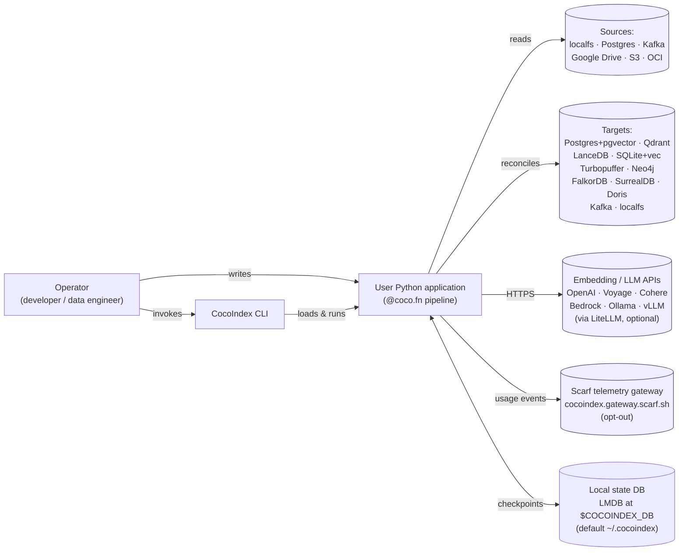
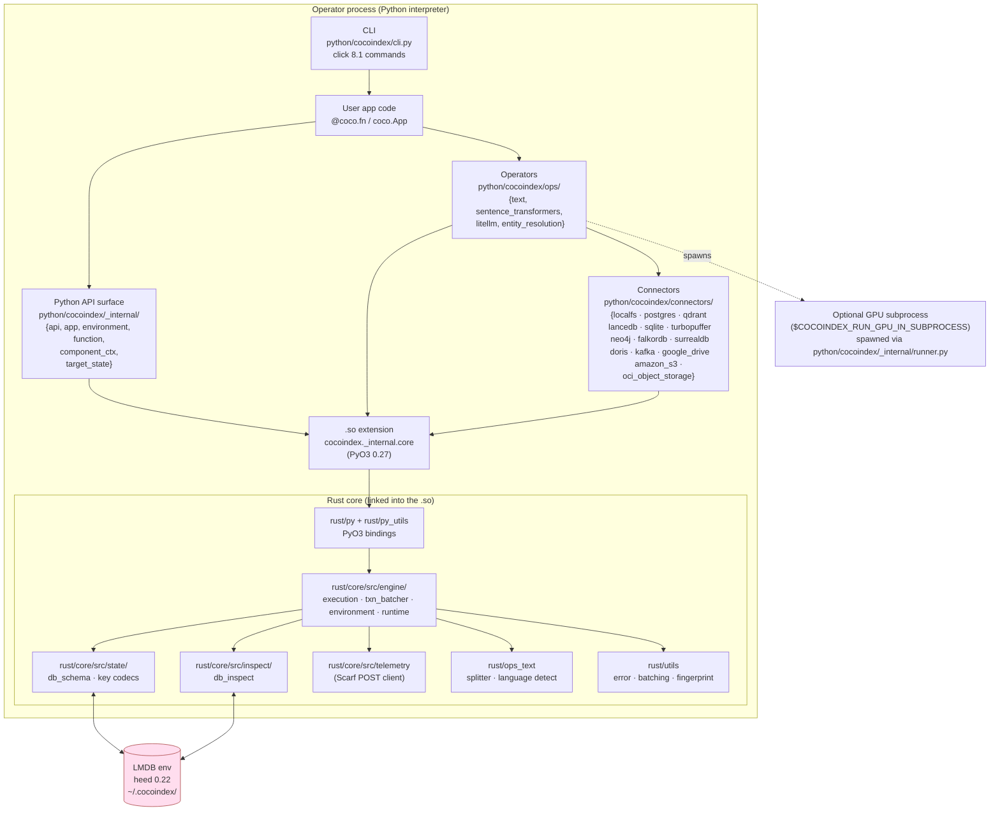
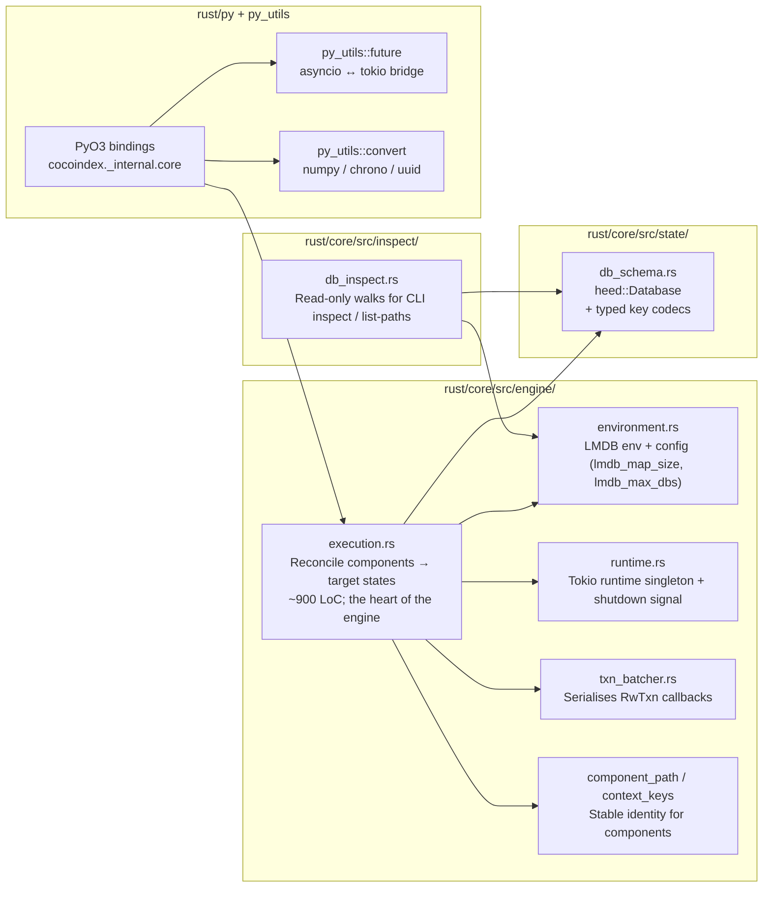
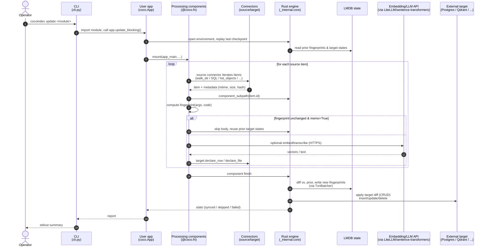

# CocoIndex — Architecture

| Field         | Value                                                               |
| ------------- | ------------------------------------------------------------------- |
| Subject       | [cocoindex-io/cocoindex](https://github.com/cocoindex-io/cocoindex) |
| Pinned tag    | `v1.0.3`                                                            |
| Pinned commit | `4432311228e4859201b457d3b6d978471692d0b1`                          |
| Vendored at   | `research/cocoindex/`                                               |
| Analyst       | `claude-opus-4.7` (1M-context, effort: high)                        |
| Scope         | §3.1 + §4.1 of `CLAUDE.md` / `AGENTS.md`. Static, read-only review. |

> **Caveat.** v1 is a *fundamental redesign* over v0 (research/cocoindex/CLAUDE.md:296;
> README banner). v0 documentation, blog posts, and any third-party tutorials older
> than mid-2025 describe a different architecture. This report covers **v1.0.3 only**.

## 1. Problem statement

CocoIndex is a Rust-core / Python-binding framework for building **incrementally
maintained indexes** over heterogeneous sources. The user describes the
desired *target state* (what files, rows, vectors should exist downstream) as a
function of source state, in plain Python; the engine performs change detection
against a local LMDB checkpoint and applies the minimum set of writes to bring
each external system back in sync. The mental model is React-for-data-pipelines:
you declare the steady state; the engine reconciles
(research/cocoindex/CLAUDE.md:62–86).

The framework ships built-in connectors for filesystems, object stores,
databases, vector stores, graph stores, and Kafka, plus operators for
recursive text splitting, sentence-transformers and LiteLLM-driven embedding,
and entity resolution.

## 2. C4 — Level 1: System Context

The user is the only human actor. There are no end-user-facing services: the
framework runs as a library inside a process the operator controls (CLI or
embedded). The Scarf telemetry edge is the *only* outbound call CocoIndex
itself originates without the user's pipeline asking for it
(rust/core/src/telemetry/mod.rs:1–117); see security.md §B7 / §B8.

## 3. C4 — Level 2: Containers

In v1.0.3 CocoIndex is a **single-process library plus CLI**, not a service.
"Container" therefore corresponds to in-process modules with distinct
responsibilities and process boundaries (CLI vs subprocess GPU runner).

### 3.1 Process boundaries

* **Main interpreter** (single OS process) holds the engine, the user pipeline,
  the LMDB env, and HTTP clients to embedding APIs. Async work is on a Tokio
  runtime hosted by the Rust extension and bridged with `pyo3-async-runtimes`
  (research/cocoindex/Cargo.toml:44–45;
  research/cocoindex/rust/core/src/engine/runtime.rs).
* **Optional GPU subprocess** runs Torch-heavy embedders out-of-process to
  isolate CUDA state and recover memory cleanly
  (`python/cocoindex/_internal/runner.py:172–199`). IPC is `pickle`-encoded
  payloads over a pipe between trusted parents and children.
* **No HTTP server.** axum is in `workspace.dependencies`
  (research/cocoindex/Cargo.toml:21–22), but in v1.0.3 every non-test reference
  is `rust/utils/src/error.rs:1–5`, which uses `axum::http::StatusCode` and
  `IntoResponse` to scaffold an `ApiError` type that no production caller
  serves. The only `axum::serve` call is inside `#[cfg(test)]` for the
  telemetry mock (rust/core/src/telemetry/mod.rs:119–183). Treat the axum
  surface as **dead/scaffolded code**, not a runtime endpoint.

### 3.2 LMDB state environment

`heed = "0.22.0"` (research/cocoindex/rust/core/Cargo.toml:14) wraps LMDB. A
single environment hosts multiple named databases keyed by app name
(rust/core/src/inspect/db_inspect.rs:68, 164). Map size and max-DBs are config
knobs (rust/core/src/engine/environment.rs:34–44). All read–write transactions
funnel through `TxnBatcher` (rust/core/src/engine/txn_batcher.rs:11–65) which
serialises writes to amortise fsync; this also means in-process write
concurrency is single-threaded by design.

## 4. C4 — Level 3: Components (engine internals)

Key invariants the engine maintains, observable in `state/db_schema.rs:1–92`
and `engine/execution.rs`:
1. **Stable component path → identity.** Every processing component (a unit of
   work declared by `coco.mount`/`use_mount`) is anchored at a stable path
   composed of names. Re-runs at the same path are joined to their previous
   target-state fingerprint set; if a path is missing in a new run, its
   children are tombstoned and the corresponding target rows/files are
   deleted. This is the engine's notion of "deletion propagation".
2. **Memoization fingerprint.** `@coco.fn(memo=True)` skips re-execution when
   `(code fingerprint, arg fingerprint)` is unchanged
   (`python/cocoindex/_internal/function.py`,
   `python/cocoindex/_internal/memo_fingerprint.py:323`).
3. **Atomic per-component sync.** When a component finishes, its declared
   target states are diffed and applied (insert/update/delete) inside a single
   transaction batched by `TxnBatcher`. Cross-component atomicity is not
   provided — that is by design, to allow large pipelines to make incremental
   progress.

## 5. End-to-end indexing pipeline (data flow)

A few details that are easy to miss from the README alone:
* **Source iteration is async.** All built-in source connectors expose
  `async` iterators or generators (e.g., the Google Drive and S3 connectors
  use `aiohttp` / `aiobotocore`).
* **Targets do not know about other targets.** The connector contract is
  per-target; cross-target consistency is achieved by reusing the same
  source-derived component path, not by a distributed transaction.
* **State changes flush per-component, not per-batch.** A failure mid-pipeline
  leaves earlier components committed; on restart only the unfinished tail
  re-runs, gated by fingerprint.

## 6. Mandatory questions (§4.1)

### What problem does the project solve, in one paragraph?

CocoIndex provides a declarative programming model and reconciliation engine
for incremental indexes built from heterogeneous sources. The user defines a
tree of *processing components* whose outputs are *target states* (rows,
files, points, vectors). The engine fingerprints components, persists the
fingerprints in a local LMDB checkpoint, diffs them on each run, and applies
the minimum set of CRUD operations to bring external targets back in sync —
including deletion when a source item disappears.

### Deployable units (processes, services, libraries, agents)

* **Library**: importable Python package `cocoindex` that links a Rust
  extension `cocoindex._internal.core` (PyO3 0.27.1, built with maturin —
  research/cocoindex/pyproject.toml:62).
* **CLI**: `cocoindex` executable, registered as a console-script entry point
  (research/cocoindex/pyproject.toml:57), implemented in `python/cocoindex/cli.py`.
* **No service binary.** No `[[bin]]` targets in any of the workspace
  `Cargo.toml` files. No long-running daemon. The axum dependency is unused at
  runtime (see §3.1).
* **Optional helper subprocess.** GPU embedding workloads can be opted into a
  subprocess via `COCOINDEX_RUN_GPU_IN_SUBPROCESS`
  (`python/cocoindex/_internal/runner.py:172–199`).

### Indexing pipeline end-to-end

See §5 for the sequence diagram. End-to-end:
1. **Source iteration** by a connector (`python/cocoindex/connectors/<src>/_source.py`).
2. **Per-item fingerprinting**, possibly with `mtime`/`size` + content hash for
   files, or row PKs for databases.
3. **User-defined transformation** (`@coco.fn`), e.g. recursive split + embed.
4. **Target-state declaration** through a target object
   (`target.declare_row(...)`, `target.declare_file(...)`, …).
5. **Diff and apply** by the engine: per-component diff against the LMDB
   checkpoint, then writes to the target system; deletions propagated to
   tombstoned target states.

### Storage backends and indices

| Role              | Backend(s)                                                                                                                                                |
| ----------------- | --------------------------------------------------------------------------------------------------------------------------------------------------------- |
| Engine state      | LMDB via heed 0.22 (research/cocoindex/rust/core/Cargo.toml:14; default path `~/.cocoindex/`).                                                            |
| Vector store      | Postgres + pgvector (research/cocoindex/Cargo.toml:43); Qdrant; LanceDB; SQLite + sqlite-vec; Turbopuffer.                                                |
| Relational target | Postgres (asyncpg); Apache Doris (MySQL wire).                                                                                                            |
| Graph target      | Neo4j; FalkorDB; SurrealDB.                                                                                                                               |
| Stream target     | Kafka.                                                                                                                                                    |
| Blob/file target  | Local filesystem (`localfs.DirTarget`).                                                                                                                   |
| Full-text search  | **Not provided as a first-class target.** Users can lean on Postgres FTS or external systems; CocoIndex itself only exposes vector and KV-shaped targets. |

### Extension points and plugin surfaces

| Surface                           | Status                                                                                                                                                                                                                                                       |
| --------------------------------- | ------------------------------------------------------------------------------------------------------------------------------------------------------------------------------------------------------------------------------------------------------------ |
| `@coco.fn` user functions         | **Stable public.** The decorator is the canonical way to write a processing step. (`python/cocoindex/__init__.py` re-exports; `_internal/function.py` is implementation.)                                                                                    |
| `Target` declaration objects      | **Stable public.** Each connector exports its target builders (e.g. `qdrant.CollectionTarget`, `postgres.TableTarget`, `localfs.DirTarget`).                                                                                                                 |
| `VectorSchemaProvider` for embeds | **Stable public.** `python/cocoindex/resources/schema.py` defines the protocol; `sentence_transformers.SentenceTransformerEmbedder` and `litellm.LiteLLMEmbedder` are reference implementations.                                                             |
| Custom connector contract         | **Not promised stable.** Connectors live under `python/cocoindex/connectors/<name>/` and use `connectorkits/` plus `_internal` types. Building a third-party connector is feasible by mirroring an existing one but the inner contract is not versioned API. |
| Engine internals                  | **Internal.** Modules under `_internal/` and Rust crates are not part of the user-facing API. Upstream `CLAUDE.md` formalises this with the underscore-prefix convention (research/cocoindex/CLAUDE.md:144–164).                                             |
| `Context` / `ContextKey`          | **Stable public.** React-style provider for shared resources (DB pools, clients).                                                                                                                                                                            |

### Runtime model

* **Single-process**, async-first. The Rust engine runs on a Tokio runtime
  installed by the extension; Python code awaits Rust futures via the
  `pyo3-async-runtimes` bridge (research/cocoindex/Cargo.toml:44–45).
* **No distributed worker/coordinator.** There is no notion of a remote
  worker, queue, or coordinator process in v1.0.3. Horizontal scaling has to
  be achieved by sharding source paths across separate processes, each with
  its own LMDB env.
* **State-DB writes are single-threaded.** All `RwTxn` callbacks are queued
  through `TxnBatcher` (rust/core/src/engine/txn_batcher.rs:11–70), which is
  appropriate for LMDB's single-writer model and means the state DB is
  never a CPU bottleneck.
* **GPU subprocess isolation** is opt-in
  (`python/cocoindex/_internal/runner.py:172–199`,
  `COCOINDEX_RUN_GPU_IN_SUBPROCESS`).

### Languages, frameworks, and major dependencies

* **Languages.** Rust 2024 edition, MSRV 1.89 (research/cocoindex/Cargo.toml:13–14);
  Python 3.11+ (research/cocoindex/pyproject.toml:11; .python-version).
* **Async runtime.** Tokio 1.48 with `full` feature (research/cocoindex/Cargo.toml:62–69).
* **PyO3 stack.** `pyo3 0.27.1` with `auto-initialize`, `chrono`, `uuid` features;
  `pyo3-async-runtimes 0.27.0` with `tokio-runtime`; `numpy 0.27.0`;
  `pythonize 0.27.0` (research/cocoindex/Cargo.toml:42–46).
* **State DB.** `heed 0.22.0` (LMDB), `storekey 0.9.0` (binary key codec)
  (research/cocoindex/Cargo.toml:60; rust/core/Cargo.toml:14).
* **Serialization.** `serde 1.0.228`, `serde_json 1.0.145`, `rmp-serde 1.3.0`
  (MessagePack); on the Python side, `msgspec 0.19.0` (per `pyproject.toml`).
* **HTTP client.** `reqwest 0.12.24` with `default-features = false`,
  `["json", "rustls-tls"]` — explicitly excluding native-TLS / OpenSSL
  (research/cocoindex/Cargo.toml:49–52). Important security property,
  see security.md §B6.
* **CLI.** click 8.1, rich 14.0, python-dotenv 1.1 (`pyproject.toml`).
* **HTTP server / API surface.** axum 0.8, axum-extra, tower-http
  (research/cocoindex/Cargo.toml:21–23, 73). **Pulled in but not served**
  in v1.0.3 — see §3.1.
* **DB drivers.** asyncpg (Python) for Postgres; `pgvector` Rust crate with
  `sqlx` + `halfvec` features (research/cocoindex/Cargo.toml:43).
* **Optional ML libraries.** sentence-transformers, transformers, torch,
  litellm, faiss (declared in `pyproject.toml` extras / examples).

## 7. Notable architectural traits & gotchas

* **"Workspace `version = "999.0.0"`"** (research/cocoindex/Cargo.toml:12).
  This is a placeholder; release tooling stamps the actual version. The
  pinned tag `v1.0.3` corresponds to the published Python wheel, not this
  string.
* **Anonymous telemetry by default** (rust/core/src/telemetry/mod.rs:1–117).
  Release builds POST `init` events to `https://cocoindex.gateway.scarf.sh`
  unless `COCOINDEX_DISABLE_USAGE_TRACKING` is set. Detailed in security.md §B7.
* **Pickle is used in three internal places**
  (`python/cocoindex/_internal/runner.py:173,199`, `memo_fingerprint.py:323`,
  `serde.py`), but always either against trusted local IPC or behind a
  `_RestrictedUnpickler` allowlist (`serde.py:185–195`). See security.md §B3.
* **No FTS target** out of the box. If the downstream product needs lexical
  search alongside vectors, it has to be implemented through Postgres FTS or
  an external index (Tantivy / Meilisearch / OpenSearch) — none of which are
  shipped as targets.
* **Single-writer state DB** is fine for a single-machine pipeline but rules
  out a co-located multi-process layout sharing one `~/.cocoindex` directory.
  Each app must own its env path.
* **Connectors are not a versioned plugin API.** Building a third-party
  connector means tracking internal types like `TargetActionSink` and
  `TargetReconcileOutput` across releases.

## 8. References

* Workspace manifest: `research/cocoindex/Cargo.toml`
* Core crate manifest: `research/cocoindex/rust/core/Cargo.toml`
* Engine: `research/cocoindex/rust/core/src/engine/{execution,txn_batcher,environment,runtime}.rs`
* State: `research/cocoindex/rust/core/src/state/db_schema.rs`
* Inspect: `research/cocoindex/rust/core/src/inspect/db_inspect.rs`
* Telemetry: `research/cocoindex/rust/core/src/telemetry/mod.rs`
* Python entry: `research/cocoindex/python/cocoindex/{cli.py,_internal/{api,app,environment,function,component_ctx,target_state,runner,memo_fingerprint,serde}.py}`
* Operator manifest: `research/cocoindex/pyproject.toml`
* Upstream design notes (treated as evidence, not procedure):
  `research/cocoindex/CLAUDE.md`, `research/cocoindex/README.md`
