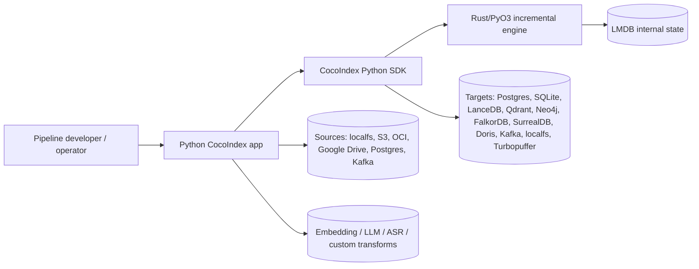
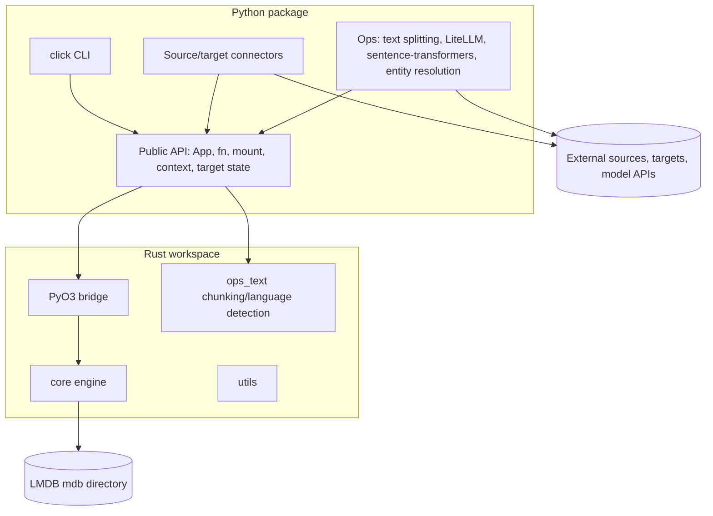
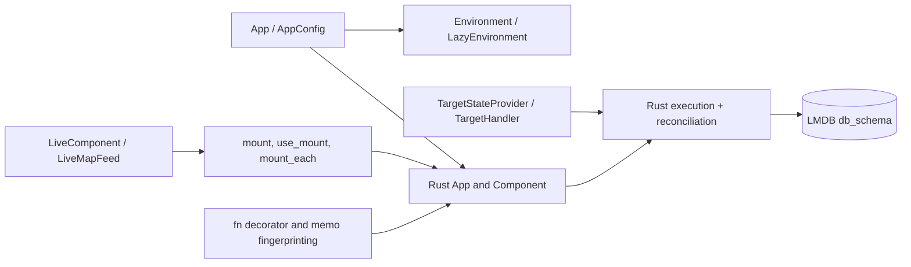
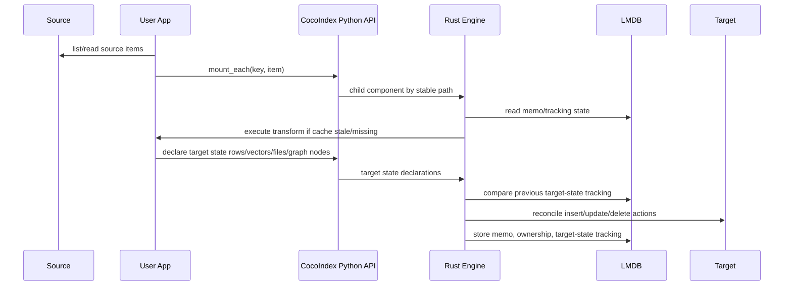

# CocoIndex v1.0.3 Architecture Review

## Metadata

- Agent: `gpt-5.5 high` (Codex)
- Pinned commit: `4432311228e4859201b457d3b6d978471692d0b1`
- Review mode: static source/documentation review only; upstream code was not run.

## Problem solved

CocoIndex solves incremental construction and maintenance of derived indexes for AI/RAG/data applications. Users write Python functions that read source state, transform records/files, and declare target state; the Rust-backed engine persists memoization and target tracking so unchanged source items and unchanged function logic can be skipped. This is stated in the package description (`research/cocoindex/pyproject.toml:5-21` @ `4432311228e4859201b457d3b6d978471692d0b1`) and in the core concepts docs, which describe declarative state-driven sync and `TargetState = Transform(SourceState)` (`research/cocoindex/docs/src/content/docs/programming_guide/core_concepts.mdx:31-54` @ `4432311228e4859201b457d3b6d978471692d0b1`).

## C4 Context

The project is a library/framework, not a hosted indexing service. The CLI is a convenience wrapper around user apps and persisted state (`research/cocoindex/python/cocoindex/cli.py:476-555` @ `4432311228e4859201b457d3b6d978471692d0b1`), while `App.update()` and `App.update_blocking()` are the runtime entry points (`research/cocoindex/python/cocoindex/_internal/app.py:299-366` @ `4432311228e4859201b457d3b6d978471692d0b1`).

## Containers

Deployable units:
- Python package `cocoindex`, built by `maturin` with PyO3 bindings into `cocoindex._internal.core` (`research/cocoindex/pyproject.toml:1-4`, `research/cocoindex/pyproject.toml:59-69` @ `4432311228e4859201b457d3b6d978471692d0b1`).
- Rust workspace members `rust/core`, `rust/utils`, `rust/py`, `rust/py_utils`, and `rust/ops_text` (`research/cocoindex/Cargo.toml:1-8` @ `4432311228e4859201b457d3b6d978471692d0b1`).
- CLI command `cocoindex = "cocoindex.cli:cli"` (`research/cocoindex/pyproject.toml:56-57` @ `4432311228e4859201b457d3b6d978471692d0b1`).
- User-defined Python apps loaded by the CLI or imported directly; loading a path executes it as a Python module (`research/cocoindex/python/cocoindex/user_app_loader.py:49-84` @ `4432311228e4859201b457d3b6d978471692d0b1`).
- Optional external containers are user-provided: Postgres, Kafka, Qdrant, LanceDB, Neo4j, FalkorDB, SurrealDB, Doris, S3/OCI/GDrive APIs, and model providers/libraries.

## Components

Key components:
- `App` registers with an environment, creates a Rust `core.App`, then starts updates by building a root component processor (`research/cocoindex/python/cocoindex/_internal/app.py:201-297`, `research/cocoindex/python/cocoindex/_internal/app.py:299-366` @ `4432311228e4859201b457d3b6d978471692d0b1`).
- `Environment` requires `Settings.db_path`, creates a `core.Environment`, and manages context, loop ownership, and a lazy lifespan (`research/cocoindex/python/cocoindex/_internal/environment.py:183-245`, `research/cocoindex/python/cocoindex/_internal/environment.py:343-417` @ `4432311228e4859201b457d3b6d978471692d0b1`).
- The Rust environment creates an LMDB `mdb` directory under `db_path`, configures max DBs/map size, clears stale readers, and holds target-provider and logic registries (`research/cocoindex/rust/core/src/engine/environment.rs:38-107` @ `4432311228e4859201b457d3b6d978471692d0b1`).
- `@coco.fn` computes logic fingerprints, memo fingerprints, and optional state-method validation (`research/cocoindex/python/cocoindex/_internal/function.py:665-693`, `research/cocoindex/python/cocoindex/_internal/function.py:731-845` @ `4432311228e4859201b457d3b6d978471692d0b1`).
- `mount`, `use_mount`, and `mount_each` create child components under stable paths, with `mount_each` accepting keyed iterables or live feeds (`research/cocoindex/python/cocoindex/_internal/api.py:245-308`, `research/cocoindex/python/cocoindex/_internal/api.py:349-529` @ `4432311228e4859201b457d3b6d978471692d0b1`).
- Target extensibility centers on `TargetHandler.reconcile`, `TargetActionSink`, `TargetStateProvider`, and `register_root_target_states_provider` (`research/cocoindex/python/cocoindex/_internal/target_state.py:188-205`, `research/cocoindex/python/cocoindex/_internal/target_state.py:208-310` @ `4432311228e4859201b457d3b6d978471692d0b1`).

## Indexing pipeline

End-to-end, a pipeline does the following:
1. Source connectors or user code enumerate files/rows/messages. Local filesystem `DirWalker.items()` yields `(relative_path, File)` pairs for `mount_each()` (`research/cocoindex/python/cocoindex/connectors/localfs/_source.py:147-168` @ `4432311228e4859201b457d3b6d978471692d0b1`). Postgres source streams rows inside a repeatable-read transaction (`research/cocoindex/python/cocoindex/connectors/postgres/_source.py:93-112` @ `4432311228e4859201b457d3b6d978471692d0b1`). Kafka exposes raw streams and keyed map feeds (`research/cocoindex/python/cocoindex/connectors/kafka/_source.py:1-8` @ `4432311228e4859201b457d3b6d978471692d0b1`).
2. `mount_each()` turns keyed items into independent child components (`research/cocoindex/python/cocoindex/_internal/api.py:445-529` @ `4432311228e4859201b457d3b6d978471692d0b1`).
3. Memoization keys combine function identity, version, args, kwargs, and registered memo hooks (`research/cocoindex/python/cocoindex/_internal/memo_fingerprint.py:333-397` @ `4432311228e4859201b457d3b6d978471692d0b1`).
4. Files expose metadata/content fingerprint state so unchanged paths can be reused, with full-content hashing as fallback (`research/cocoindex/python/cocoindex/resources/file.py:160-202` @ `4432311228e4859201b457d3b6d978471692d0b1`).
5. Target declarations flow through `declare_target_state` or `declare_target_state_with_child` into Rust (`research/cocoindex/python/cocoindex/_internal/target_state.py:265-302` @ `4432311228e4859201b457d3b6d978471692d0b1`).
6. Target connectors calculate diffs and apply writes. The shared `statediff.diff()` helper returns insert/upsert/replace/delete based on desired and previous tracking records (`research/cocoindex/python/cocoindex/connectorkits/statediff.py:149-187` @ `4432311228e4859201b457d3b6d978471692d0b1`).
7. Rust persists component memoization, function memoization, target-state ownership, child existence, and ID sequencer state in LMDB key spaces (`research/cocoindex/rust/core/src/state/db_schema.rs:20-103`, `research/cocoindex/rust/core/src/state/db_schema.rs:168-325` @ `4432311228e4859201b457d3b6d978471692d0b1`).

## Storage backends and indices

Internal storage:
- LMDB under `db_path/mdb`, configured by `lmdb_max_dbs` and `lmdb_map_size` (`research/cocoindex/rust/core/src/engine/environment.rs:73-90` @ `4432311228e4859201b457d3b6d978471692d0b1`).
- Docs state LMDB tracks target states and memoization results, and `COCOINDEX_DB` supplies the path when not set programmatically (`research/cocoindex/docs/src/content/docs/advanced_topics/internal_storage.mdx:1-33` @ `4432311228e4859201b457d3b6d978471692d0b1`).

Target storage:
- Relational/vector-capable: Postgres with optional pgvector (`research/cocoindex/python/cocoindex/connectors/postgres/_target.py:944-994` @ `4432311228e4859201b457d3b6d978471692d0b1`), SQLite with sqlite-vec virtual tables (`research/cocoindex/python/cocoindex/connectors/sqlite/_target.py:121-151` @ `4432311228e4859201b457d3b6d978471692d0b1`), Doris.
- Vector DBs: LanceDB, Qdrant, Turbopuffer.
- Graph DBs: Neo4j, FalkorDB, SurrealDB.
- Streams/files: Kafka and local filesystem targets.

Vector schema:
- `VectorSchema` and `VectorSchemaProvider` let connectors infer vector dimensions/dtypes from annotations or embedder instances (`research/cocoindex/docs/src/content/docs/common_resources/vector_schema.mdx:8-49`, `research/cocoindex/docs/src/content/docs/common_resources/vector_schema.mdx:109-113` @ `4432311228e4859201b457d3b6d978471692d0b1`).
- `MultiVectorSchema` supports multi-vector representations such as ColBERT/ColPali-style token vectors (`research/cocoindex/docs/src/content/docs/common_resources/vector_schema.mdx:111-121` @ `4432311228e4859201b457d3b6d978471692d0b1`).

## Extension points and plugin surfaces

Stable-looking public surfaces:
- Public API re-exported from `cocoindex.__init__` (`research/cocoindex/python/cocoindex/__init__.py:10-15` @ `4432311228e4859201b457d3b6d978471692d0b1`).
- `@coco.fn` and `@coco.fn.as_async` decorators (`research/cocoindex/python/cocoindex/_internal/function.py:1838-2015` @ `4432311228e4859201b457d3b6d978471692d0b1`).
- `ContextKey`/`EnvironmentBuilder.provide()` for shared resources (`research/cocoindex/python/cocoindex/_internal/environment.py:87-116` @ `4432311228e4859201b457d3b6d978471692d0b1`).
- `LiveComponent`, `LiveMapFeed`, and `mount_each()` live-feed integration (`research/cocoindex/python/cocoindex/_internal/api.py:491-493` @ `4432311228e4859201b457d3b6d978471692d0b1`).
- `TargetHandler`/`TargetActionSink`/`register_root_target_states_provider` for custom target connectors (`research/cocoindex/python/cocoindex/_internal/target_state.py:99-162`, `research/cocoindex/python/cocoindex/_internal/target_state.py:305-310` @ `4432311228e4859201b457d3b6d978471692d0b1`).
- `FileLike`, `FilePathMatcher`, and `PatternFilePathMatcher` for source/file abstractions (`research/cocoindex/python/cocoindex/resources/file.py:40-67`, `research/cocoindex/python/cocoindex/resources/file.py:205-259` @ `4432311228e4859201b457d3b6d978471692d0b1`).

Private/internal surfaces:
- Most modules live under `_internal` or connector-private `_target.py` / `_source.py`, so code depending on connector internals should be treated as fragile.
- The Rust/PyO3 core is not a stable external API; Python wrappers are the intended integration layer.

## Runtime model

CocoIndex is primarily embedded/single-process from the user perspective, with asynchronous components scheduled through Python and Rust runtimes. The Python `Environment` owns or reuses event loops and creates a Rust `AsyncContext` (`research/cocoindex/python/cocoindex/_internal/environment.py:39-84`, `research/cocoindex/python/cocoindex/_internal/environment.py:212-245` @ `4432311228e4859201b457d3b6d978471692d0b1`). The Rust `App.update()` spawns a Tokio task and exposes progress through watch channels (`research/cocoindex/rust/core/src/engine/app.rs:88-152` @ `4432311228e4859201b457d3b6d978471692d0b1`). GPU/model functions can use a singleton `GPURunner`; subprocess isolation is opt-in via `COCOINDEX_RUN_GPU_IN_SUBPROCESS=1` (`research/cocoindex/python/cocoindex/_internal/runner.py:1-9`, `research/cocoindex/python/cocoindex/_internal/runner.py:236-278` @ `4432311228e4859201b457d3b6d978471692d0b1`).

## Stack

- Languages: Python and Rust. GitHub reports Python 75.0% and Rust 24.5% on the repository page as of 2026-05-06 (<https://github.com/cocoindex-io/cocoindex>).
- Python runtime: package metadata requires Python `>=3.11`, while classifiers include Python 3.11-3.14 (`research/cocoindex/pyproject.toml:11-42` @ `4432311228e4859201b457d3b6d978471692d0b1`).
- Python dependencies: click, rich, dotenv, watchfiles, numpy, psutil, msgspec as base dependencies, with optional extras for LiteLLM, sentence-transformers, ColPali, LanceDB, Postgres, Qdrant, SQLite, SurrealDB, Google Drive, S3, Doris, graph DBs, Kafka, OCI, and entity resolution (`research/cocoindex/pyproject.toml:12-126` @ `4432311228e4859201b457d3b6d978471692d0b1`).
- Rust dependencies include axum, tokio, reqwest with rustls, pyo3, rmp-serde, serde, tower-http, tracing, uuid, and tree-sitter dependencies in `ops_text` (`research/cocoindex/Cargo.toml:17-78` @ `4432311228e4859201b457d3b6d978471692d0b1`).
