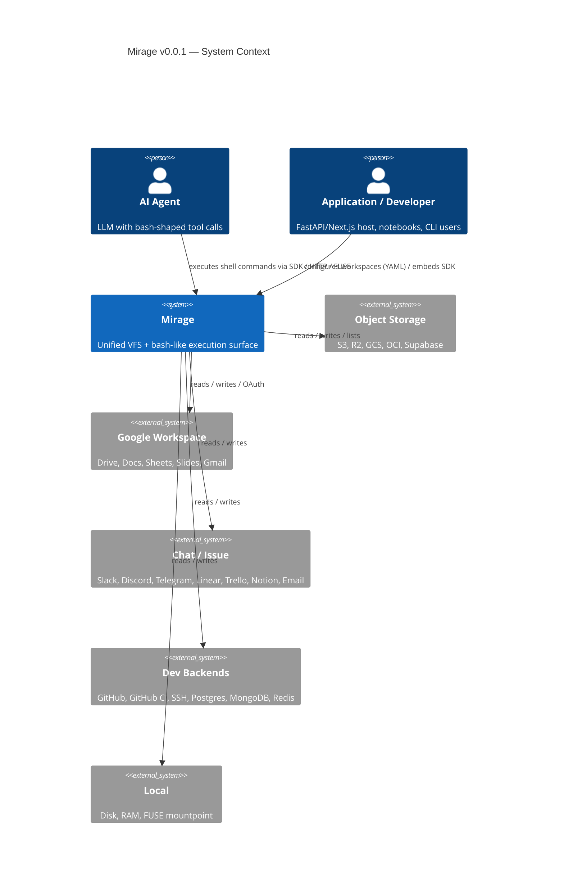
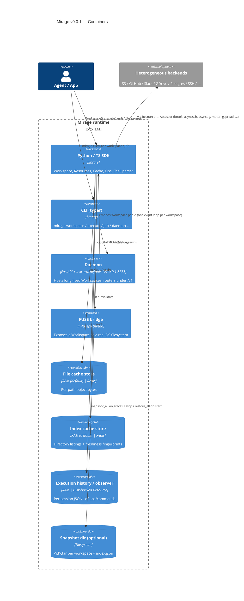
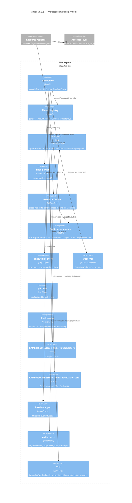
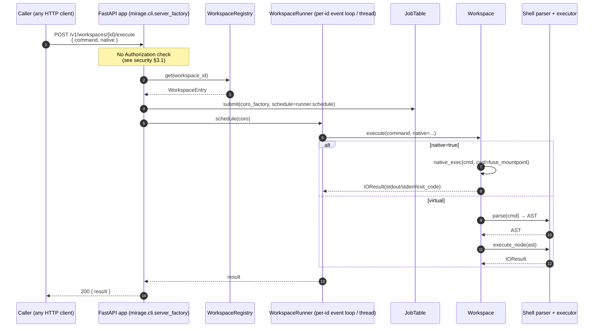

# Mirage v0.0.1 — Architecture

> Run: `claude-opus-4.7-xhigh` · Pinned ref: tag `v0.0.1`, commit
> `8b99fb9247ecb40725d4718bac58e3bb230aad34` · Submodule:
> `research/mirage/`

All file references in this document are relative to `research/mirage/`
at the pinned commit.

---

## 1. What problem does Mirage solve?

Mirage is a **unified virtual filesystem (VFS) for AI agents**. It mounts
heterogeneous backends — object stores, productivity SaaS, mailboxes,
databases, dev tools — under a single root and lets agents move data
between them with familiar Unix-shell verbs (`ls`, `cat`, `cp`, `grep`,
`find`, `jq`, `wc`, `mv`, …). The pitch is that LLMs already speak bash
fluently; mounting every service as a folder lets the model reuse that
fluency instead of learning N SDK schemas
(`research/mirage/README.md:26-51`,
`research/mirage/python/pyproject.toml:1-7`).

Mirage is **not a search engine, not an embedding store, and not an
indexer in the semantic-search sense**. The only "index" inside the code
base is a TTL'd directory-listing/metadata cache, and the only "index
cache" backend choices are RAM and Redis
(`research/mirage/python/mirage/cache/index/__init__.py`,
`research/mirage/python/mirage/cache/index/store.py`,
`research/mirage/python/mirage/cache/file/__init__.py`). Re-read
§3.1.4.1 of the issue against that fact: applying mirage to indexit's
goals means treating it as a **source-abstraction layer** that an
indexer could sit on top of, not as the indexer itself.

The repository ships a **dual implementation**: a Python package
(`research/mirage/python/`) and a TypeScript monorepo
(`research/mirage/typescript/`) with sibling packages `core`, `node`,
`browser`, `cli`, `server`, `agents`. The Python package is the more
complete one at `v0.0.1` (29 resources, full daemon, FUSE bridge); this
analysis focuses on it and notes TypeScript parity points where they
matter (`research/mirage/AGENTS.md:6-13`,
`research/mirage/typescript/pnpm-workspace.yaml`).

---

## 2. C4 — System Context



**Trust note for the diagram.** The agent in the top-left is treated as a
*tool consumer*, not as a *trusted user*. Anything the agent emits to
mirage's `execute()` ends up either parsed by tree-sitter-bash and run
through the in-process VFS dispatcher, or — when `native=True` — dropped
straight into `asyncio.create_subprocess_shell` on the daemon host
(`research/mirage/python/mirage/workspace/native.py:20-42`). That makes
the agent's prompt-injection blast radius the same as the host's shell
blast radius. See `security.md` finding §3.1.

---

## 3. C4 — Containers



### 3.1. Deployable units

| Unit | Where | Lifecycle |
| --- | --- | --- |
| `mirage-ai` Python library | imported in-process | per-app |
| `mirage` CLI | `python -m mirage.cli.main` (`research/mirage/python/pyproject.toml:62-63`) | per-invocation; auto-spawns daemon |
| Mirage daemon | `uvicorn mirage.cli.server_factory:app --host 127.0.0.1 --port 8765` (`research/mirage/python/mirage/cli/client.py:98-127`) | long-lived, idle-timeout |
| FUSE mount | `mfusepy.FUSE(MirageFS, mountpoint, nothreads=True, foreground=True, direct_io=True)` (`research/mirage/python/mirage/fuse/mount.py:27-44`) | per-Workspace |
| TS sibling daemon | `@struktoai/mirage-server` (`research/mirage/typescript/packages/server/`) | per-invocation |

The daemon is **not multi-tenant**: it is intended as a single-user
helper that exposes a localhost API to the user's CLI, agents, and
applications (`research/mirage/python/mirage/cli/settings.py:20`). When
the lifespan ends, every active workspace is closed
(`research/mirage/python/mirage/server/app.py:78-89`). Optional
`MIRAGE_PERSIST_DIR` snapshots all workspaces to tar on shutdown and
rehydrates them on startup
(`research/mirage/python/mirage/server/persist.py:70-146`).

---

## 4. C4 — Components (Python `Workspace`)



### 4.1. Layer responsibilities

* **`Workspace`** (`research/mirage/python/mirage/workspace/workspace.py:70-538`)
  is the public facade. It owns mount registry, file cache, observer,
  job table, session manager, history, and FUSE manager; it dispatches
  ops and runs the parsed shell tree.
* **`MountRegistry` + `Mount`**
  (`research/mirage/python/mirage/workspace/mount/`) keeps a
  `{prefix: Mount}` table where each `Mount` carries `(resource,
  MountMode, ConsistencyPolicy)`. The default cache mount lives at the
  root and serves dispatch fallbacks
  (`research/mirage/python/mirage/workspace/workspace.py:93-118`).
* **`Ops`** (`research/mirage/python/mirage/ops/ops.py`,
  `research/mirage/python/mirage/ops/registry.py`,
  `research/mirage/python/mirage/ops/open.py`,
  `research/mirage/python/mirage/ops/os_patch.py`) is the in-process op
  router. When a `Workspace` is used as a context manager
  (`with ws as ...`), `Workspace.__enter__` *patches* `builtins.open`
  and `sys.modules["os"]` so library code (e.g. pandas, pillow) reads
  through the VFS too
  (`research/mirage/python/mirage/workspace/workspace.py:254-263`). This
  is a major API choice: the boundary between "agent VFS" and "process
  VFS" is dissolved by monkey-patching.
* **Shell parser** is a thin wrapper around `tree-sitter-bash`
  (`research/mirage/python/mirage/shell/parse.py:15-28`). The parsed
  tree is walked by the executor
  (`research/mirage/python/mirage/workspace/node/execute_node.py`,
  `…/executor/`); pipes, redirects, control flow (`if`, `while`,
  `for`, `||`, `&&`), and globs are expanded entirely inside Python.
  Tree-sitter is **lenient** — invalid bash parses to a partial tree
  rather than rejecting; the executor must validate.
* **Built-in commands** (`research/mirage/python/mirage/commands/`)
  are dual-rooted: a per-helper module (`grep_helper.py`,
  `cat_helper.py`, `jq_helper.py`, …) and per-resource subdirectories
  that override or specialise (`commands/builtin/s3/`,
  `commands/builtin/github/`, `commands/builtin/notion/`, …). The
  registry resolves each verb to a callable for the involved
  resource(s), letting the same `grep` know how to push down a search
  to S3 list-and-fetch versus run locally on a RAM blob
  (`research/mirage/python/mirage/commands/registry.py`,
  `research/mirage/python/mirage/commands/resolve.py`).
* **`Observer`** (`research/mirage/python/mirage/observe/observer.py`)
  appends a JSONL line per op + per command into
  `<observe_prefix>/<UTC date>/<session>.jsonl` on a chosen resource.
  Default observer resource is RAM but the constructor accepts any
  `BaseResource` — including `DiskResource`. **stdin, stdout, command
  text are stored verbatim** (line 80-91). This is the single biggest
  privacy surface in mirage; see `security.md` finding §3.13.
* **`JobTable`** (`research/mirage/python/mirage/shell/job_table.py`)
  models bash background jobs (`cmd &`) for FUSE/native paths.
* **VFP** (`research/mirage/python/mirage/vfp/`) is the closest thing
  in the codebase to "protocol". It defines pydantic types for an
  RPC-flavoured filesystem-protocol surface (`fs/read`, `fs/readdir`,
  `fs/glob`, `command/exec`, `workspace/snapshot`, …) with a
  capability declaration that can be rendered into an LLM system
  prompt (`research/mirage/python/mirage/vfp/skill.py`,
  `…/vfp/methods.py`, `…/vfp/capability.py`). At v0.0.1 it is a *type
  surface and skill renderer only*; no transport layer is wired to it.
  The HTTP daemon (`/v1/...`) is a separate, simpler API.

---

## 5. The "indexing" pipeline (or rather: the read pipeline)

There is no semantic indexing pipeline in mirage. The closest analogue
is the **read pipeline through the cache**, which I mapped end-to-end:

```mermaid
sequenceDiagram
    autonumber
    participant Agent
    participant WS as Workspace
    participant P as tree-sitter-bash
    participant E as executor
    participant Reg as MountRegistry
    participant FC as FileCacheStore
    participant IC as IndexCacheStore
    participant R as Resource (e.g. S3Resource)
    participant A as Accessor (boto3)
    participant Up as Upstream (S3 API)

    Agent->>WS: execute("grep alert /s3/data/log.jsonl | wc -l")
    WS->>P: parse(cmd)
    P-->>WS: AST
    WS->>E: execute_node(ast, session, dispatch)
    E->>Reg: mount_for("/s3/data/log.jsonl")
    Reg-->>E: Mount(S3Resource, READ, LAZY)
    E->>WS: dispatch("read", path)
    WS->>FC: get(path)
    alt cache hit
        FC-->>WS: bytes
    else cache miss
        WS->>R: execute_op("read", path)
        R->>A: read_bytes(path)
        A->>Up: GET /bucket/data/log.jsonl
        Up-->>A: bytes
        A-->>R: bytes
        R-->>WS: bytes
        WS->>FC: put(path, bytes)
    end
    Note over WS,IC: readdir / find use the index cache;<br/>ConsistencyPolicy.ALWAYS re-stats fingerprint per dispatch
    WS->>E: bytes / stream
    E-->>WS: pipe stages run in-process<br/>(grep_helper → wc_helper)
    WS-->>Agent: IOResult(stdout=b"42\n", exit_code=0)
```

Key invariants:

* Cache is **per-path keyed**. There is no fingerprint dedup.
  Aliases (e.g., `/s3/x.txt` and a copy at `/disk/x.txt`) cache twice.
* `ConsistencyPolicy.ALWAYS` re-stats the upstream every dispatch
  (`research/mirage/python/mirage/workspace/workspace.py:382-395`).
  `LAZY` (default) trusts the cache until TTL.
* Writes invalidate the file cache for the path and the index cache for
  its parent dir
  (`research/mirage/python/mirage/workspace/workspace.py:399-445`).
* When `native=True`, the AST path is bypassed: the raw command is
  handed to `asyncio.create_subprocess_shell` with cwd = FUSE
  mountpoint. This is real OS shell, not the parser
  (`research/mirage/python/mirage/workspace/workspace.py:489-499`,
  `research/mirage/python/mirage/workspace/native.py:26`).

---

## 6. Storage backends and indices

| Layer | Backend | Purpose |
| --- | --- | --- |
| File cache | `RAMFileCacheStore` (default, 512 MB), `RedisFileCacheStore` | Per-path object bytes |
| Index cache | `RAMIndexCacheStore` (default, 600 s TTL), `RedisIndexCacheStore` | Directory listings, fingerprints, freshness |
| History | `ExecutionHistory` (RAM ring buffer, 100 entries default; optional `history_path`) | Per-session command+stdout records |
| Observer | configurable `BaseResource` (default RAM, can be Disk) | JSONL log of ops + commands |
| Snapshot | tar (optionally `gz`/`bz2`/`xz`) on disk OR in-memory `BytesIO` | Workspace state across daemon restarts |

There is **no vector store, no full-text index, no inverted index**
anywhere. Search through a mount goes through the **upstream's own
search** (Slack search API, GitHub search API, …) when the resource
exposes a *search-pushdown* command, otherwise it streams object bytes
through `grep`/`rg`/`jq` running in the executor's thread
(`research/mirage/docs/plans/2026-04-26-search-pushdown-multipath.md`,
`research/mirage/python/mirage/commands/builtin/grep_helper.py`,
`…/rg_helper.py`).

---

## 7. Extension points and plugin surfaces

| Surface | Stability | How to extend |
| --- | --- | --- |
| `Resource` registry — add a new backend | **Public, stable enough** | Subclass `BaseResource` + `Accessor` + per-op functions; register in `REGISTRY` (`research/mirage/python/mirage/resource/registry.py:28-107`) or pass via `load_backend_class("./script.py:MyClass")` (`research/mirage/python/mirage/resource/loader.py:34-49`) |
| Custom commands | **Public** | `@command("verb", resources=[...])` in `mirage.commands.registry`; loaded per-resource (`research/mirage/python/mirage/commands/registry.py`) |
| Cache stores | **Public** | Provide a `CacheConfig` / store class with the same interface as `RAMFileCacheStore` (`research/mirage/python/mirage/cache/file/`) |
| Index stores | **Public** | Same shape as `RAMIndexCacheStore` (`research/mirage/python/mirage/cache/index/`) |
| Observer resource | **Public** | Pass any `BaseResource` to `Workspace(observe=...)` |
| Agent framework adapters | **Public** | `mirage.agents.openai_agents.MirageSandboxClient` and TS `@struktoai/mirage-agents` cover OpenAI Agents SDK, Vercel AI SDK, LangChain, Pydantic AI, CAMEL, OpenHands, DeepAgents (extras list `pyproject.toml:108-129`) |
| Daemon HTTP API | **Public, but unauth** | `mirage.server.routers.{workspaces,sessions,execute,jobs,health}` — see `security.md` §3.1, §3.3 |
| VFP capability declarations | **Internal-leaning** | `mirage.vfp.skill.render(declaration)` produces an LLM system-prompt blurb; the matching wire protocol is not implemented |
| FUSE filesystem | **Public, OS-dependent** | macFUSE (macOS) / libfuse (Linux); `Workspace(fuse=True)` |
| Backwards compatibility | **No commitment** | `research/mirage/AGENTS.md:33-36` ("No need to consider backward compatibility for the code") |

The largest amount of public surface is the *resource* shape. Most other
extension points are smaller — caches, commands, agents.

---

## 8. Runtime model

* **Single-process per Workspace.** The daemon hosts multiple workspaces
  but each one runs in its own asyncio event loop on its own
  `WorkspaceRunner` thread
  (`research/mirage/python/mirage/server/registry.py`,
  `research/mirage/python/mirage/workspace/runner.py`).
* **Async-first.** Every resource op is `async`; the SDK is built around
  `asyncio`. The sync entry points (`Workspace.__enter__` patching `os`
  and `open`, FUSE callbacks via `bridge.sync.run_async_from_sync`)
  funnel through the same loop
  (`research/mirage/python/mirage/bridge/sync.py`,
  `research/mirage/python/mirage/bridge/thread.py`,
  `research/mirage/python/mirage/fuse/fs.py:53-59`).
* **No worker pool.** All I/O is in-process. Parquet/HDF5/PDF parsing
  and ASR (`sherpa-onnx`) happen on the same loop / thread.
* **Embedded vs. detached.**
  * Embedded: `from mirage import Workspace` — runs in the host
    process. Suitable for FastAPI handlers, notebooks.
  * CLI/daemon: separate uvicorn process; CLI is a thin HTTP client.
* **Concurrency model for daemon.** The runtime hardcodes
  `--host 127.0.0.1` for self-spawned daemons but accepts the
  `MIRAGE_DAEMON_URL` env var, so an operator running
  `uvicorn mirage.cli.server_factory:app --host 0.0.0.0` can expose the
  API to anyone reachable
  (`research/mirage/python/mirage/cli/client.py:98-117`,
  `research/mirage/python/mirage/cli/settings.py:42-74`). At that point
  the unauth posture (security §3.1) becomes externally exploitable.

---

## 9. Stack / dependencies

| Layer | Choice |
| --- | --- |
| Language | Python ≥ 3.12 (stdlib only on the type/path level) |
| HTTP server | FastAPI + uvicorn |
| CLI | Typer (`mirage.cli.main:app`) |
| Shell parser | tree-sitter + tree-sitter-bash |
| FS bridge | mfusepy (FUSE) |
| Async file I/O | aiofiles |
| HTTP client | httpx, aiohttp |
| Validation | pydantic v2 |
| Serialization | orjson, pyyaml, tomllib |
| Subprocess | `asyncio.create_subprocess_shell` (native exec) |
| Object stores | aioboto3 (S3, R2, GCS, OCI) |
| Google Workspace | google-* SDKs (declared as optional, installed via extras) |
| SSH | asyncssh + paramiko (extras) |
| Postgres | asyncpg (extras) |
| MongoDB | motor (extras) |
| Redis | redis[hiredis] (extras) |
| Email | aioimaplib + aiosmtplib (extras) |
| PDF / images | pypdfium2 + pillow |
| Parquet / Arrow | pandas + pyarrow (extras) |
| HDF5 | h5py + tables (extras) |
| Audio | av + sherpa-onnx + tinytag (extras) |
| Agent SDKs | openai, openai-agents, anthropic, pydantic-ai, deepagents, openhands-sdk, camel-ai (extras) |

(`research/mirage/python/pyproject.toml:36-129`)

The dependency surface is broad — 22 backends + multiple agent SDKs —
but the **default install is small**: only the dependencies listed
under `[project.dependencies]` come in unconditionally
(`research/mirage/python/pyproject.toml:36-54`). Each backend is opted
into via extras, which keeps the import-time cost bounded.

---

## 10. C4 — runtime view of HTTP request → execute



The lack of authentication is not an oversight in this diagram — it
reflects the actual code (see security §3.1). The *client* knows about
auth tokens; the *server* never reads them.

---

## 11. Notes for the diagrams

The mermaid sources live inline in this file. Rendered SVG is not
extracted to `diagrams/` because the Mermaid sources are the canonical
form and stay diffable. Should anyone need raster output, run the
sources through `mmdc` (`@mermaid-js/mermaid-cli`).

---

## 12. Cross-references

* For the security view of the daemon and its endpoints, see
  `security.md`.
* For the goal-fit assessment (Sparkle, multimodal), see
  `applicability.md`.
* For the executive summary and the verdict matrix, see `README.md`.
