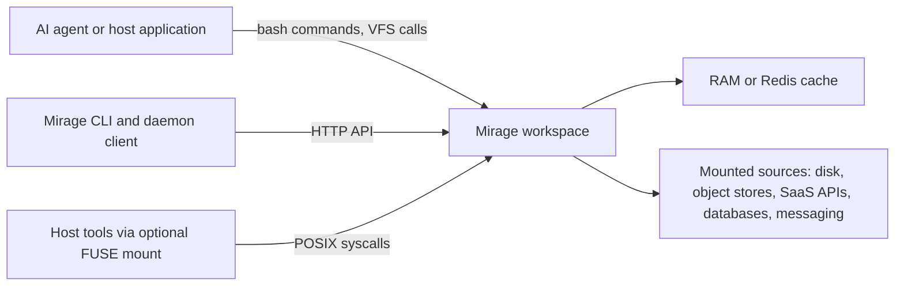
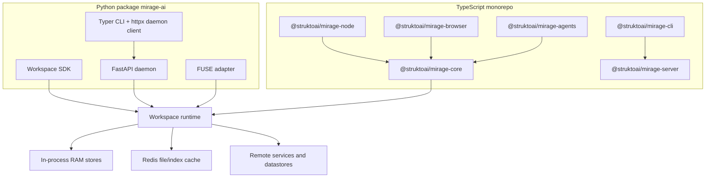
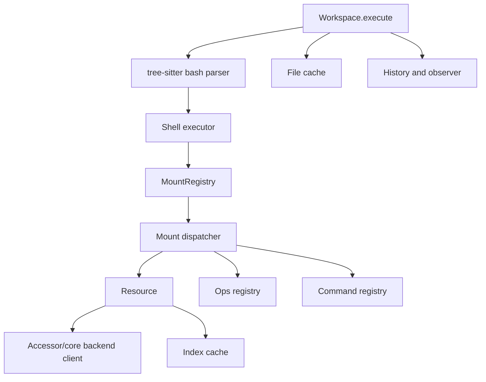
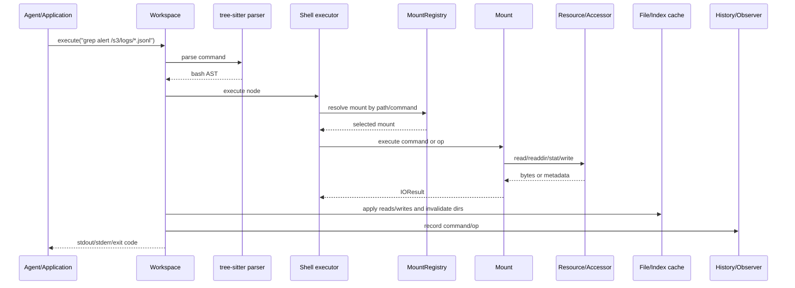

# Mirage Architecture Review

All citations refer to `research/mirage` at pinned upstream commit `8b99fb9247ecb40725d4718bac58e3bb230aad34` (`v0.0.1`).

## Problem Statement

Mirage solves the agent-access problem, not the search-ranking problem: it presents heterogeneous backends as one virtual filesystem tree so agents can use familiar bash-like commands across services. The README defines it as a unified VFS for AI agents that mounts S3, Google Drive, Slack, Gmail, Redis, and similar systems side by side (`research/mirage/README.md:26`-`research/mirage/README.md:28`). The docs describe four layers: agent/application, Mirage Bash and VFS, dispatcher/cache, and infrastructure/remotes (`research/mirage/docs/home/architecture.mdx:12`-`research/mirage/docs/home/architecture.mdx:28`).

## C4 Context

The agent/application side can issue bash commands, VFS calls, or syscalls (`research/mirage/docs/home/architecture.mdx:14`-`research/mirage/docs/home/architecture.mdx:20`). Mirage then routes operations to mounted resources and uses index/file caches for repeated metadata and byte reads (`research/mirage/docs/home/architecture.mdx:22`-`research/mirage/docs/home/architecture.mdx:28`).

## C4 Containers

Deployable units are:
- Python library and CLI package `mirage-ai`, version `0.0.1`, Python `>=3.12`, Apache-2.0 (`research/mirage/python/pyproject.toml:1`-`research/mirage/python/pyproject.toml:8`; `research/mirage/python/pyproject.toml:62`-`research/mirage/python/pyproject.toml:63`).
- Optional Python FastAPI daemon built by `build_app()` and exposing workspace/session/execute/jobs/health routers (`research/mirage/python/mirage/server/app.py:92`-`research/mirage/python/mirage/server/app.py:129`).
- Optional FUSE adapter, documented as a way to expose the same tree to host tools (`research/mirage/docs/home/concepts.mdx:79`-`research/mirage/docs/home/concepts.mdx:83`).
- TypeScript monorepo packages for core, node, browser, CLI, server, and agent adapters (`research/mirage/typescript/packages/core/package.json:2`; `research/mirage/typescript/packages/node/package.json:2`; `research/mirage/typescript/packages/browser/package.json:2`; `research/mirage/typescript/packages/cli/package.json:2`; `research/mirage/typescript/packages/server/package.json:2`; `research/mirage/typescript/packages/agents/package.json:2`).

## C4 Components

The `Workspace` owns mounts, cache, command execution, sessions, jobs, and execution history (`research/mirage/python/mirage/workspace/workspace.py:70`-`research/mirage/python/mirage/workspace/workspace.py:92`; `research/mirage/docs/home/concepts.mdx:30`-`research/mirage/docs/home/concepts.mdx:34`). Commands are parsed by a tree-sitter bash parser (`research/mirage/python/mirage/shell/parse.py:15`-`research/mirage/python/mirage/shell/parse.py:28`) and dispatched through `MountRegistry`, a longest-prefix-match router (`research/mirage/python/mirage/workspace/mount/registry.py:26`-`research/mirage/python/mirage/workspace/mount/registry.py:32`).

Each mount resolves commands and ops through a cascade of filetype-specific, resource-specific, and general handlers (`research/mirage/python/mirage/workspace/mount/mount.py:29`-`research/mirage/python/mirage/workspace/mount/mount.py:40`). Read-only enforcement is at the mount layer for write commands and write ops (`research/mirage/python/mirage/workspace/mount/mount.py:370`-`research/mirage/python/mirage/workspace/mount/mount.py:375`; `research/mirage/python/mirage/workspace/mount/mount.py:407`-`research/mirage/python/mirage/workspace/mount/mount.py:408`).

## Command And Retrieval Pipeline

Mirage does not implement a semantic indexing pipeline from source to ranked query result. Its actual pipeline is a VFS command/retrieval pipeline:

`Workspace.execute()` parses the command, executes the AST, applies a barrier, updates cache state, and records history/observer data (`research/mirage/python/mirage/workspace/workspace.py:481`-`research/mirage/python/mirage/workspace/workspace.py:538`). Dispatch selects a mount by path, checks the remote file cache for read ops, calls the mount op, and invalidates cache entries on write ops (`research/mirage/python/mirage/workspace/workspace.py:374`-`research/mirage/python/mirage/workspace/workspace.py:402`). Cross-mount operations are explicitly handled for `cp`, `mv`, `diff`, `cmp`, and multi-read commands such as `cat`, `grep`, and `rg` (`research/mirage/python/mirage/workspace/executor/cross_mount.py:22`-`research/mirage/python/mirage/workspace/executor/cross_mount.py:58`).

## Storage Backends And Indices

Mirage has two cache families, not a search index family:
- **Index cache**: directory/listing metadata entries with fields `id`, `name`, `resource_type`, `remote_time`, `index_time`, `vfs_name`, `size`, and `extra` (`research/mirage/python/mirage/cache/index/config.py:32`-`research/mirage/python/mirage/cache/index/config.py:40`).
- **File cache**: byte cache implemented as RAM LRU by default, with cache size, entries, drain tasks, and optional max drain bytes (`research/mirage/python/mirage/cache/file/ram.py:26`-`research/mirage/python/mirage/cache/file/ram.py:45`).
- **Redis cache option**: both file cache and index cache can use Redis configs (`research/mirage/python/mirage/config.py:111`-`research/mirage/python/mirage/config.py:119`; `research/mirage/python/mirage/cache/index/config.py:53`-`research/mirage/python/mirage/cache/index/config.py:61`).

The README describes index cache as listings/metadata and file cache as object bytes (`research/mirage/README.md:213`-`research/mirage/README.md:220`). There is no vector store, embedding table, full-text inverted index, or ranking model in the index schema.

## Resource And Connector Surface

The Python registry supports RAM, disk, Redis, S3/R2/OCI/Supabase/GCS, GitHub/GitHub CI, Linear, Google Docs/Sheets/Slides/Drive, Slack, Discord, Gmail, Trello, Telegram, MongoDB, Postgres, Notion, Langfuse, SSH, Email, and Paperclip (`research/mirage/python/mirage/resource/registry.py:28`-`research/mirage/python/mirage/resource/registry.py:107`). The resource matrix also lists local infrastructure, object stores, Google Workspace, cloud files, code/devops, messaging, databases, notes, and other resources with mount modes (`research/mirage/docs/home/resource-matrix.mdx:15`-`research/mirage/docs/home/resource-matrix.mdx:93`).

## Extension Points

Stable-looking extension surfaces:
- Resource factory registry: `build_resource()` only constructs names present in `REGISTRY` and lazy-loads resource/config classes (`research/mirage/python/mirage/resource/registry.py:110`-`research/mirage/python/mirage/resource/registry.py:137`).
- Command decorators and specs: commands declare resource, filetype, write semantics, provision hooks, and specs (`research/mirage/python/mirage/commands/config.py:48`-`research/mirage/python/mirage/commands/config.py:94`).
- Mount-level command/op registration: mounted resources register resource commands, general commands, and ops (`research/mirage/python/mirage/workspace/mount/registry.py:58`-`research/mirage/python/mirage/workspace/mount/registry.py:81`).
- Optional local audio commands are exported as `AUDIO_COMMANDS` for disk, RAM, and S3 (`research/mirage/python/mirage/commands/local_audio/__init__.py:15`-`research/mirage/python/mirage/commands/local_audio/__init__.py:23`).

Experimental/internal surfaces:
- VFP schema describes itself as a hand-written sample, with unspecified wire format and future generated canonical schema (`research/mirage/python/mirage/vfp/schema/vfp-0.1.json:1`-`research/mirage/python/mirage/vfp/schema/vfp-0.1.json:5`).
- Snapshot restore dynamically reconstructs resource classes from serialized class paths (`research/mirage/python/mirage/workspace/snapshot/state.py:293`-`research/mirage/python/mirage/workspace/snapshot/state.py:315`), which makes snapshot format a privileged internal contract.

## Runtime Model

The embedded runtime is a single process with async execution. The daemon runtime hosts multiple workspaces and pins each workspace to its own thread and event loop (`research/mirage/python/mirage/workspace/runner.py:27`-`research/mirage/python/mirage/workspace/runner.py:39`; `research/mirage/python/mirage/workspace/runner.py:50`-`research/mirage/python/mirage/workspace/runner.py:67`). The CLI auto-spawns a local `uvicorn` daemon on `127.0.0.1` (`research/mirage/python/mirage/cli/client.py:98`-`research/mirage/python/mirage/cli/client.py:127`). FUSE is optional and exposes Mirage as a host filesystem surface (`research/mirage/python/mirage/fuse/fs.py:36`-`research/mirage/python/mirage/fuse/fs.py:59`).

## Languages, Frameworks, And Dependencies

Python stack: Python `>=3.12`, FastAPI, httpx, Typer, uvicorn, tree-sitter/tree-sitter-bash, pypdfium2, Pillow, jq, mfusepy, and optional extras for object stores, SSH, Redis, databases, PDF, audio, and agent integrations (`research/mirage/python/pyproject.toml:36`-`research/mirage/python/pyproject.toml:54`; `research/mirage/python/pyproject.toml:72`-`research/mirage/python/pyproject.toml:152`).

TypeScript stack: private ESM monorepo managed by `pnpm@10.32.1`, with build/test/typecheck/lint scripts and dev dependencies including AWS SDK clients, Changesets, ESLint, Prettier, TypeScript, and Vitest (`research/mirage/typescript/package.json:1`-`research/mirage/typescript/package.json:33`).

## Architecture Checklist

| Question                      | Answer                                                                                                                                                                    |
| ----------------------------- | ------------------------------------------------------------------------------------------------------------------------------------------------------------------------- |
| What problem does it solve?   | It gives agents one shell/VFS abstraction over heterogeneous services, not a semantic search engine.                                                                      |
| Deployable units?             | Python SDK, CLI, FastAPI daemon, optional FUSE adapter, TypeScript core/node/browser/CLI/server/agents packages.                                                          |
| Source-to-query pipeline?     | Source access is command-driven: parse bash, resolve mount, invoke command/op, read/write backend, update caches, return `IOResult`. No semantic ranking pipeline exists. |
| Storage backends and indices? | RAM and Redis index/file caches; source systems remain authoritative. Index entries are metadata/listing objects, not vector/full-text indices.                           |
| Extension points?             | Resource registry, command/op decorators, mount registration, filetype-specific handlers, optional audio command packages, experimental VFP schema.                       |
| Runtime model?                | Embedded async workspace; daemon uses one thread/event loop per workspace; optional local HTTP daemon and optional FUSE mount.                                            |
| Stack?                        | Python/FastAPI/tree-sitter/FUSE plus TypeScript ESM monorepo.                                                                                                             |
