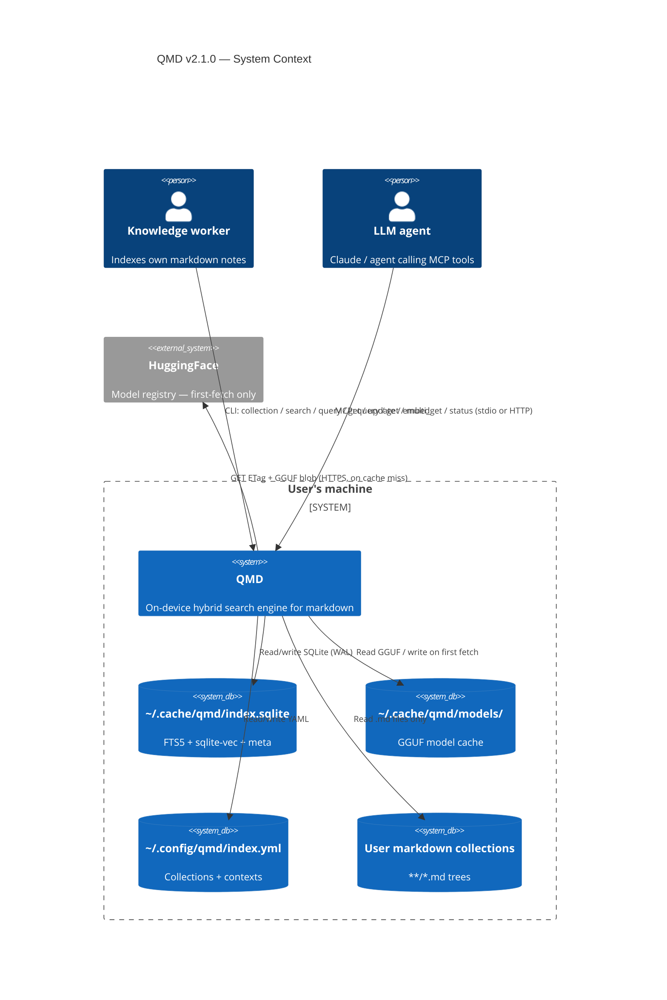
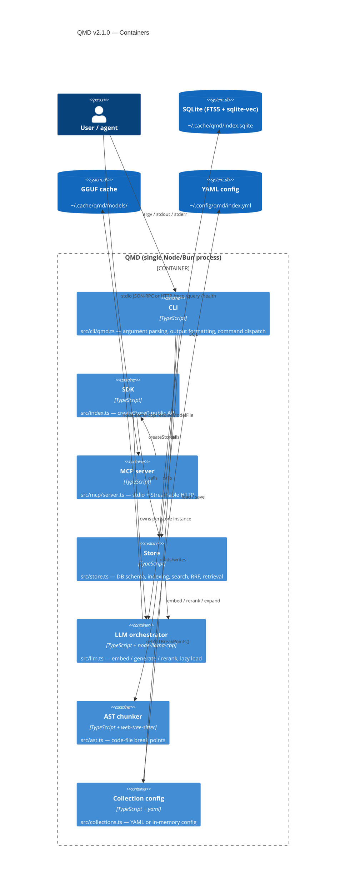
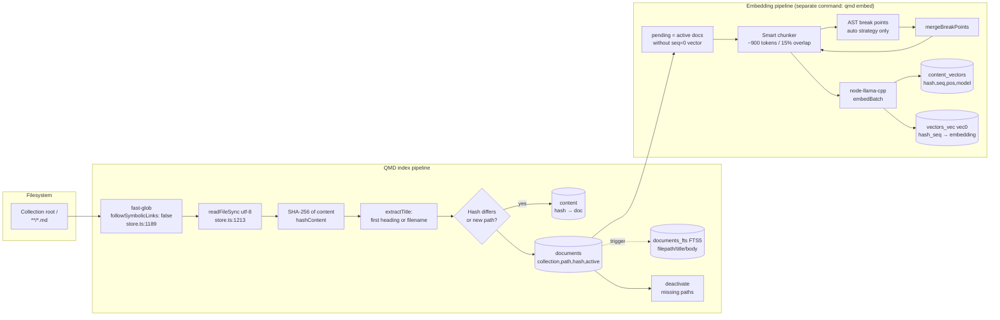
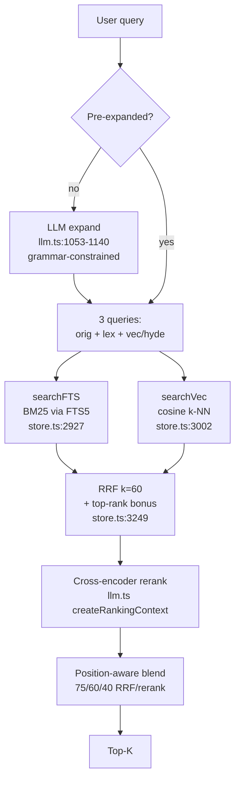
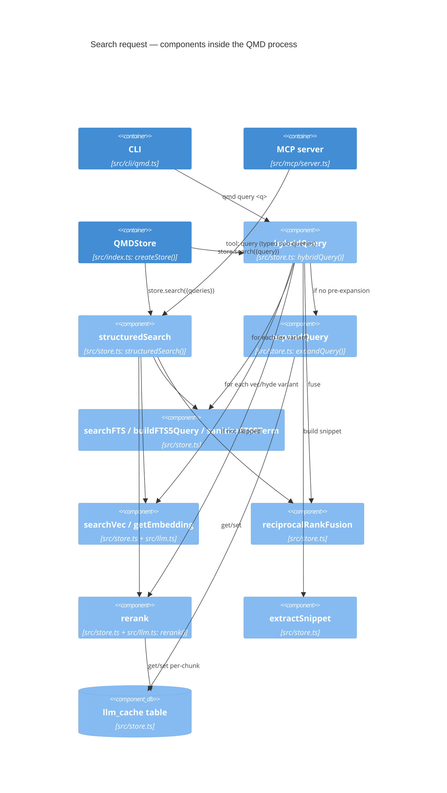

# QMD v2.1.0 — Architecture

| Field         | Value                                                                                                       |
| ------------- | ----------------------------------------------------------------------------------------------------------- |
| Subject       | [tobi/qmd](https://github.com/tobi/qmd) @ `v2.1.0`                                                          |
| Pinned commit | `65cd1b3fd02891d1ee0eefa751620918664fa321`                                                                  |
| Vendored at   | `research/qmd/`                                                                                             |
| Analyst       | claude-opus-4.7, effort=xhigh                                                                               |

This document answers CLAUDE.md §3.1 and §4.1. All citations refer to files
under `research/qmd/` at the pinned commit. Line numbers are stable for that
commit.

## A1. Problem statement (one paragraph)

QMD is an **on-device hybrid search engine over markdown corpora**. It indexes
collections of `.md` files, builds a content-addressable store with both a
BM25 (SQLite FTS5) keyword index and a sqlite-vec dense vector index, and
exposes search via a CLI, an SDK, and an MCP (Model Context Protocol) server.
At query time, results from BM25 and vector search are fused (Reciprocal Rank
Fusion), then optionally rescored by a local cross-encoder reranker; a small
local LLM is used for query expansion. All three models are GGUF files
auto-downloaded from HuggingFace and run via `node-llama-cpp`. There is no
server component, no network egress at search time, and no shared
infrastructure (`research/qmd/README.md:5`,
`research/qmd/src/store.ts:1-46`).

## A2. C4 — System Context

Key trust boundaries:

- **Filesystem ↔ QMD process.** QMD runs as the invoking user; it reads
  any file the user can read, including symlinked targets that match the
  glob (see [`security.md`](security.md) F-2).
- **YAML / SQLite store_collections ↔ `qmd update`.** A `update:` shell
  command stored in the YAML or in the `store_collections.update_command`
  column is `bash -c`-executed when `qmd update` runs
  (`src/cli/qmd.ts:559`). Whoever can write those files can run code as
  the user — by design (F-1).
- **MCP HTTP transport ↔ local processes.** When `qmd mcp --http` is
  running, any local process or DNS-rebound browser can hit
  `localhost:8181` with no authentication (`src/mcp/server.ts:798`,
  F-3).
- **HuggingFace ↔ model cache.** Model bytes are downloaded on first
  use; ETag is checked for cache freshness only, not integrity. The
  default query-expansion model is hosted on the maintainer's personal
  HF account (F-6).

## A3. C4 — Container Diagram

Notable shape: there is **no daemon, no service, no external dependency
process**. Even MCP HTTP is a foreground or detached `node` subprocess of
the same package (`src/cli/qmd.ts:3192-3220`). The "store" is a SQLite
file with WAL journal mode (`src/store.ts:739`).

## A4. Indexing pipeline

End-to-end walk-through with citations (pinned commit
`65cd1b3fd02891d1ee0eefa751620918664fa321`):

1. **Glob.** `reindexCollection` uses `fast-glob` rooted at the
   collection's `path` with the per-collection `pattern` (default
   `**/*.md`), `followSymbolicLinks: false`, `dot: false`, and a
   hard-coded ignore list of `node_modules`, `.git`, `.cache`,
   `vendor`, `dist`, `build` plus the YAML `ignore:` array
   (`src/store.ts:1183-1195`). After globbing it filters out any path
   whose components start with `.` (`src/store.ts:1196-1200`).

2. **Read.** Each file is `readFileSync(filepath, "utf-8")` after
   `getRealPath()` (`realpathSync`) on the resolved absolute path
   (`src/store.ts:1207-1213`, `src/store.ts:554-560`). Empty content is
   skipped.

3. **Hash & title.** Content is SHA-256-hashed (`hashContent`,
   `src/store.ts:2017`); title is the first H1 / H2 / H3 heading or the
   filename (`extractTitle`, `src/store.ts:2045`); a 6-char prefix of
   the hash is the public `docid` (`getDocid`,
   `src/store.ts:1689-1691`).

4. **Upsert.** A single document row holds `(collection, path, title,
   hash, modified_at, active)`; the body is content-addressed in
   `content (hash, doc, created_at)` (`src/store.ts:747-770`). Path
   names are normalised via `handelize()` — lowercased,
   non-letter/non-digit collapsed to `-`, triple underscore promoted to
   `/`, emoji codepoints to hex (`src/store.ts:1711-1762`). FTS5 is
   kept in sync by `documents_ai` / `documents_au` / `documents_ad`
   triggers (`src/store.ts:833-868`).

5. **Deactivate.** Documents whose paths are no longer in the glob
   result are flipped `active = 0`; orphaned content rows are pruned
   via `cleanupOrphanedContent` (`src/store.ts:1258-1268`,
   `src/store.ts:1943-1953`). There is no tombstoning beyond
   `active=0`.

6. **Embed (separate command, `qmd embed`).** `getPendingEmbeddingDocs`
   selects active docs without a `seq=0` row in `content_vectors`
   (`src/store.ts:1332-1342`). Documents are chunked at ~900 tokens
   with 15% overlap; chunk boundaries are scored by markdown break
   points (heading, code-fence, blank line, list, etc.) with a
   squared-distance decay (`src/store.ts:97-110`,
   `src/store.ts:188-224`). With `--chunk-strategy auto`, code files
   get extra break points from `tree-sitter` AST queries — class /
   interface / struct / function / import — merged with the markdown
   scores (`src/ast.ts:87-165`, `src/store.ts:236-251`). Code-fence
   regions are excluded from cuts (`src/store.ts:144-173`).

7. **Embed call.** Chunks are formatted (`title: … | text: …` for
   embeddinggemma; instruct prefix for Qwen3-Embedding;
   `src/llm.ts:38-58`) and batched through
   `LlamaEmbeddingContext.getEmbeddingFor` over a pool of contexts
   sized by VRAM / CPU cores (`src/llm.ts:638-710`). Result vectors are
   inserted into `content_vectors` (metadata) and `vectors_vec`
   (sqlite-vec virtual table; `src/store.ts:3135-3155`). Vector
   dimensionality is captured at first insertion and the table is
   recreated only if it changes (`src/store.ts:1050-1070`).

## A5. Query pipeline

- **Expansion.** `expandQuery` uses the local Qwen3-1.7B fine-tune
  (`hf:tobil/qmd-query-expansion-1.7B-gguf/...q4_k_m.gguf`,
  `src/llm.ts:199`) inside a grammar-constrained
  `LlamaChatSession.prompt` so the model can only emit lines of the
  form `lex: …` / `vec: …` / `hyde: …` (`src/llm.ts:1064-1071`).
  Output is cached in the `llm_cache` table by SHA-256 of `(method,
  query, model, intent)` (`src/store.ts:1893-1912`).

- **BM25.** `buildFTS5Query` parses the user input into FTS5 syntax,
  preserving exact phrases and `-negation`, with strict whitelisting
  of terms via `sanitizeFTS5Term` (only `\p{L}\p{N}'_`,
  `src/store.ts:2777-2902`). The SQL uses a CTE that forces FTS5 to
  run before the collection filter so the planner can't degenerate to
  a full scan (`src/store.ts:2943-2972`). Raw BM25 (negative, lower is
  better) is mapped to `[0, 1)` via `|x| / (1 + |x|)`
  (`src/store.ts:2980`).

- **Vector.** `searchVec` embeds the query with the same model used
  for documents, runs a two-step query — first
  `vectors_vec MATCH ? AND k = ?` to get `(hash_seq, distance)`, then
  a JOIN-free SELECT to enrich rows — because `sqlite-vec` virtual
  tables hang when joined directly (`src/store.ts:3009-3053`).

- **Fusion.** `reciprocalRankFusion` weights the original query 2× and
  adds `+0.05` for top-1 / `+0.02` for ranks 2–3 in any list to
  preserve exact matches against expansion drift
  (`src/store.ts:3249-3292`).

- **Rerank.** `rerank` calls
  `LlamaModel.createRankingContext().rankAndSort()` (Qwen3-Reranker
  0.6B by default, ~640 MB VRAM at flashAttention=true,
  `src/llm.ts:782-834`). Cache key is per-chunk (not per-file) so
  identical chunks across files score once
  (`src/store.ts:3200-3243`).

- **Blend.** Position-aware blend in `hybridQuery`: ranks 1–3 stay
  75/25 RRF/rerank, 4–10 go 60/40, 11+ go 40/60
  (`research/qmd/README.md:454-462`).

## A6. C4 — Component (search request)

## A7. Storage backends and indices

| Table             | Kind                | Purpose                                                                   | Source                                       |
| ----------------- | ------------------- | ------------------------------------------------------------------------- | -------------------------------------------- |
| `content`         | SQLite              | Content-addressable bodies: `(hash PRIMARY KEY, doc, created_at)`         | `src/store.ts:747-753`                       |
| `documents`       | SQLite              | File-system layer: `(id, collection, path, title, hash, modified_at, active)`; FK to `content.hash`; UNIQUE `(collection, path)` | `src/store.ts:757-770`                       |
| `documents_fts`   | SQLite FTS5         | `(filepath, title, body)`, `tokenize='porter unicode61'`, kept in sync by triggers | `src/store.ts:825-868`                       |
| `content_vectors` | SQLite              | Per-chunk metadata `(hash, seq, pos, model, embedded_at)`; PK `(hash,seq)` | `src/store.ts:792-801`                       |
| `vectors_vec`     | sqlite-vec `vec0`   | Dense embeddings: `(hash_seq TEXT PK, embedding float[N], cosine)`        | `src/store.ts:1067-1069`                     |
| `store_collections` | SQLite            | `(name, path, pattern, ignore_patterns JSON, include_by_default, update_command, context JSON)` — self-contained DB so the YAML is optional | `src/store.ts:803-814`                       |
| `store_config`    | SQLite              | Key-value: `global_context`, `config_hash` (sync-skip optimisation)        | `src/store.ts:817-822`, `:1009-1043`         |
| `llm_cache`       | SQLite              | Memoisation: `(hash, result, created_at)`; capped at 1 000 most-recent rows on insert | `src/store.ts:777-783`, `:1893-1912`         |

Notable absences:
- No per-modality table, no media metadata, no source-system reference,
  no permissions / ACLs, no `etag`, no symlink-target column.
- `documents_fts.filepath` is `collection || '/' || path` — the only
  cross-collection identifier exposed.
- `content_vectors.model` records *which* embedding model was used so
  that a cross-model search would be detectable, but the
  `vectors_vec` table holds only one dimensionality at a time
  (`src/store.ts:1054-1065`).

## A8. Extension points

| Surface                                 | Stability                | Detail                                                                                                                          |
| --------------------------------------- | ------------------------ | ------------------------------------------------------------------------------------------------------------------------------- |
| **Public SDK** `createStore`, `QMDStore` | Stable, exported         | `src/index.ts:338-541`. Documented with examples in upstream `README.md`.                                                       |
| **Chunk strategy** `regex` / `auto`      | Stable                   | `src/store.ts:230` — auto adds AST-aware break points for TS/TSX/JS/JSX/Python/Go/Rust (`src/ast.ts`).                          |
| **Embedding model**                      | Pluggable via env / YAML | `QMD_EMBED_MODEL` env or `models.embed:` in YAML; format functions branch on `Qwen` vs nomic-style template (`src/llm.ts:29-58`). The vector table is recreated on dimension change (`src/store.ts:1050-1070`). |
| **Rerank / generate models**             | Pluggable via env        | `QMD_RERANK_MODEL`, `QMD_GENERATE_MODEL` (`src/llm.ts:441`). Code paths assume Qwen3-style behaviour for grammar-constrained expansion. |
| **Per-collection `update:`**             | Stable, by-design        | A user-defined shell command (`bash -c`) run before reindexing (`src/cli/qmd.ts:556-588`).                                      |
| **Editor URI template**                  | Stable                   | `QMD_EDITOR_URI` env or `editor_uri` in YAML, with `{path}/{line}/{col}` (`src/cli/qmd.ts:1868-1912`).                          |
| **MCP tools / resources**                | Owned API                | `query`, `get`, `multi_get`, `status` exposed via SDK (`src/mcp/server.ts:172-533`).                                            |
| **No connector framework**               | —                        | QMD has no notion of "source type" beyond a filesystem glob. There is no plug-in API for non-filesystem sources, no async ingest, no batch source iterator. |
| **No metadata sidecar API**              | —                        | The schema is closed. Adding bucket tags, ACLs, MIME, or external IDs requires either patching QMD or maintaining a parallel table in the same SQLite file. |

## A9. Runtime model

- **Process.** Single Node ≥ 22 or Bun process. CLI commands open the
  DB, do work, and exit (`src/store.ts:1586`). The store is *not* a
  daemon by default. `qmd mcp` keeps the process alive for stdio-MCP;
  `qmd mcp --http` runs a foreground HTTP server; `qmd mcp --http
  --daemon` re-spawns itself with `nodeSpawn(process.execPath, args, {
  detached: true })` and writes `~/.cache/qmd/mcp.pid` (`src/cli/qmd.ts:3192-3220`).
- **Concurrency.** SQLite WAL mode allows many readers, one writer
  (`src/store.ts:739`). The HTTP MCP server treats the store as
  shared, stateless; per-client sessions hold transports only
  (`src/mcp/server.ts:577`). Writers (re-index, embed) are not
  guarded by a process-level lock; concurrent `qmd update` runs
  rely on SQLite's file lock.
- **Lazy LLM loading.** `LlamaCpp` instances lazy-load each model on
  first call, keep contexts warm, and dispose them after 5 min of
  inactivity (`src/llm.ts:444-540`). Models stay loaded across the
  context dispose; full disposal requires `disposeModelsOnInactivity:
  true` or process exit.
- **GPU detection.** `getLlama({ gpu: "auto" })` with CPU fallback on
  init failure; `QMD_LLAMA_GPU=false` forces CPU (`src/llm.ts:556-587`).
- **Cache locations.** All under `${XDG_CACHE_HOME:-~/.cache}/qmd/`:
  `index.sqlite`, `models/`, `mcp.pid`, `mcp.log` (`src/store.ts:530-547`,
  `src/llm.ts:212-215`, `src/cli/qmd.ts:340-344`).

## A10. Stack

| Concern                  | Pinned dep                                                | Notes                                                                                                |
| ------------------------ | --------------------------------------------------------- | ---------------------------------------------------------------------------------------------------- |
| Runtime                  | Node ≥ 22, Bun ≥ 1                                        | `package.json:90`. Cross-runtime via `src/db.ts`.                                                    |
| SQLite layer             | `better-sqlite3@7.6.13` (Node) / `bun:sqlite` (Bun)       | `package.json:48-69`. macOS Homebrew SQLite is auto-loaded under Bun for extension support.          |
| Vector index             | `sqlite-vec@0.1.9` + per-platform optional native binaries | `package.json:53-63`.                                                                                |
| Local LLM runtime        | `node-llama-cpp@3.18.1`                                   | `package.json:51`. Owns model download, GPU dispatch, embedding/ranking contexts.                    |
| AST chunking             | `web-tree-sitter@0.26.7` + grammar packages (optional)    | `package.json:54`, `optionalDependencies` for go/python/rust/typescript grammars.                    |
| MCP SDK                  | `@modelcontextprotocol/sdk@1.29.0`                        | `package.json:48`. Stdio + Streamable HTTP transports.                                               |
| File globbing            | `fast-glob@3.3.3` + `picomatch@4.0.4`                     | `package.json:50, 52`.                                                                               |
| Schema validation        | `zod@4.2.1`                                                | `package.json:56`. Used in MCP tool schemas.                                                         |
| YAML config              | `yaml@2.8.3`                                               | `package.json:55`.                                                                                   |
| Tests                    | `vitest@3.2.4` + `tsx@4.21.0`                              | `package.json:69-72`.                                                                                |
| Build                    | `tsc -p tsconfig.build.json` then prepend shebang         | `package.json:25`. Final CLI is JS + a shell wrapper that picks node vs bun based on lockfile presence (`bin/qmd`). |
| CI                       | GitHub Actions, ubuntu-latest + macos-latest              | `.github/workflows/ci.yml`. Matrix Node 22 / 23 + Bun. No supply-chain audit step.                   |
| Release                  | `--provenance --access public` to npm on `v*` tag        | `.github/workflows/publish.yml`.                                                                     |
| Hooks                    | `scripts/install-hooks.sh` installs `pre-push`            | Validates package.json version vs tag, CHANGELOG entry, GitHub CI check status before push.          |

All direct dependencies are pinned to exact versions (no `^` / `~`),
explicitly so per the `chore: pin all dependencies to exact versions`
commit on 2026-04-05 visible in `git log`.

## A11. Mandatory §4.1 questions — explicit answers

1. **What problem does the project solve?** — On-device hybrid search
   (BM25 + vector + LLM rerank) over personal markdown corpora; see
   §A1.
2. **What are the deployable units?** — A single npm package
   (`@tobilu/qmd`) shipping a CLI binary, an SDK (`createStore`), and
   an MCP server, all in one Node/Bun process; see §A3.
3. **What does the indexing pipeline look like end-to-end?** — Glob →
   read → hash → upsert → FTS5 trigger → (separate) chunk → embed →
   `vectors_vec`; see §A4 with citations.
4. **What storage backends and indices?** — One SQLite file with FTS5
   for keyword, sqlite-vec `vec0` for dense vectors, plain tables
   for content + documents + collections + cache; see §A7.
5. **What are the extension points?** — Public SDK,
   chunk-strategy choice, embed/rerank/generate model URIs, the
   per-collection `update:` shell hook, the editor URI template; see
   §A8. There is **no connector framework or pluggable source type**.
6. **What is the runtime model?** — Single short-lived process for CLI;
   long-lived only when running MCP; SQLite WAL provides read
   concurrency; LLM models lazy-loaded per process; see §A9.
7. **What languages, frameworks, and major dependencies?** — TypeScript
   on Node 22+ / Bun, `node-llama-cpp` for local GGUF, `better-sqlite3`
   + `sqlite-vec` + FTS5, `web-tree-sitter` for AST chunking,
   `@modelcontextprotocol/sdk`; see §A10.
