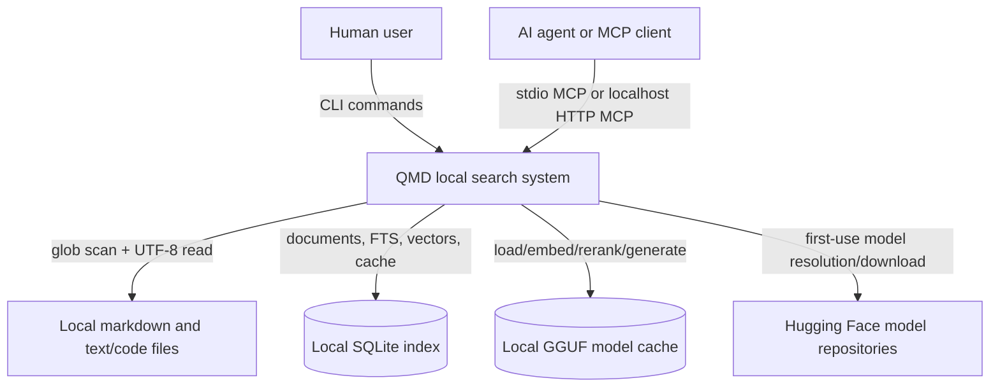
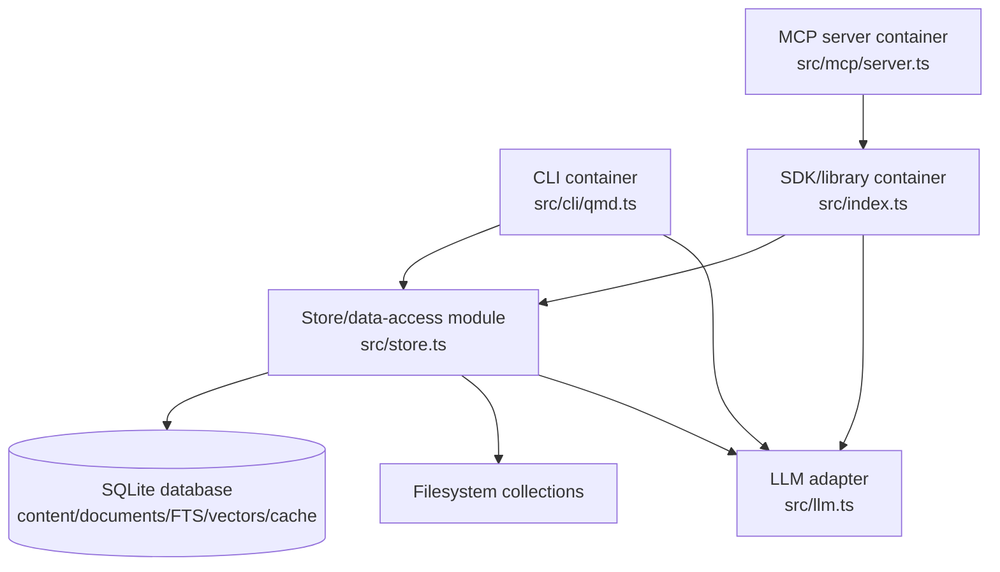
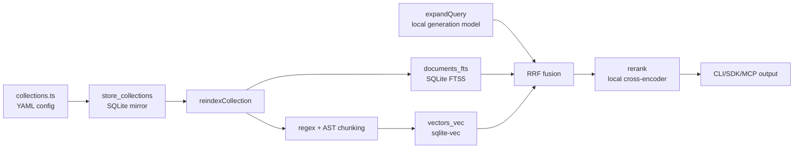
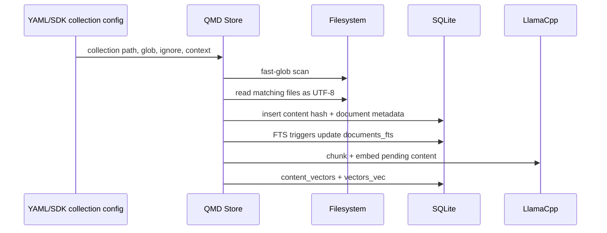
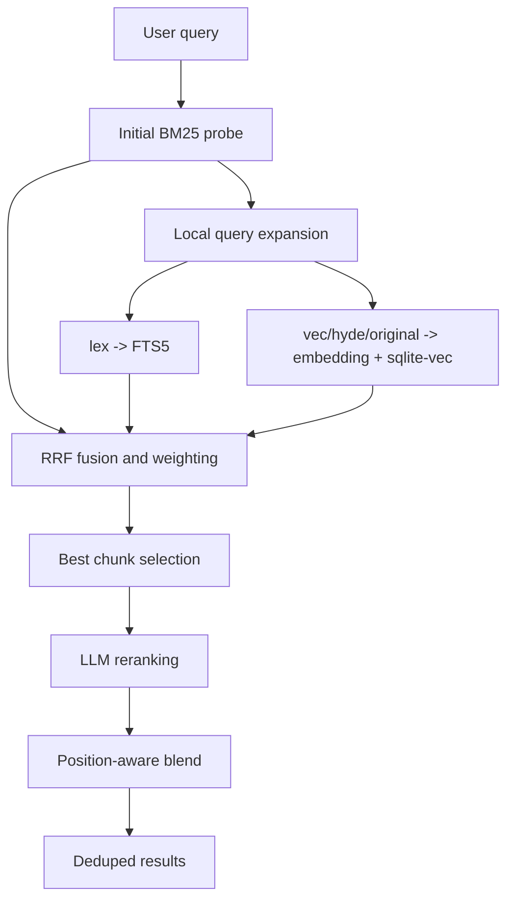

# QMD v2.1.0 Architecture Review

## Metadata

- Agent slug: `gpt-5.5-xhigh`
- Subject: `tobi/qmd`
- Pinned tag: `v2.1.0`
- Pinned commit: `65cd1b3fd02891d1ee0eefa751620918664fa321`
- Scope: static review only.

All QMD-specific citations refer to `research/qmd/` at commit `65cd1b3fd02891d1ee0eefa751620918664fa321`.

## Problem

QMD solves local search over markdown notes, meeting transcripts, documentation, and knowledge bases. It combines SQLite FTS5 BM25, vector search, local query expansion, and local LLM reranking so users and agents can search by keywords or natural language without a hosted search service (`research/qmd/README.md:1`, `research/qmd/README.md:3`, `research/qmd/README.md:5` @ `65cd1b3...`). The package description narrows the product to "on-device hybrid search for markdown files" (`research/qmd/package.json:4` @ `65cd1b3...`).

## C4 Context

The user-facing surfaces are the `qmd` binary and the SDK export declared by `package.json` (`research/qmd/package.json:6`, `research/qmd/package.json:14` @ `65cd1b3...`). The agent-facing surface is MCP: the README lists `query`, `get`, `multi_get`, and `status` tools and documents stdio plus HTTP transports (`research/qmd/README.md:72`, `research/qmd/README.md:76`, `research/qmd/README.md:115` @ `65cd1b3...`). The data plane is local filesystem input, SQLite storage, and local GGUF model files cached under `~/.cache/qmd/models/` (`research/qmd/README.md:486`, `research/qmd/README.md:494` @ `65cd1b3...`).

## C4 Containers

Deployable units are:
- `qmd` CLI: `package.json` maps the executable name to `bin/qmd`, and `bin/qmd` dispatches to Node or Bun based on installed lockfiles (`research/qmd/package.json:14`, `research/qmd/bin/qmd:1`, `research/qmd/bin/qmd:18`, `research/qmd/bin/qmd:26` @ `65cd1b3...`).
- SDK/library: `package.json` exports `dist/index.js` and `dist/index.d.ts`, while `src/index.ts` exposes `createStore`, `QMDStore`, search, retrieval, collection, context, indexing, embedding, and lifecycle methods (`research/qmd/package.json:6`, `research/qmd/package.json:8`, `research/qmd/src/index.ts:216`, `research/qmd/src/index.ts:338` @ `65cd1b3...`).
- MCP server: `src/mcp/server.ts` registers MCP tools/resources and starts stdio or localhost HTTP transports (`research/qmd/src/mcp/server.ts:172`, `research/qmd/src/mcp/server.ts:186`, `research/qmd/src/mcp/server.ts:238`, `research/qmd/src/mcp/server.ts:540`, `research/qmd/src/mcp/server.ts:565` @ `65cd1b3...`).
- SQLite index: `src/store.ts` creates content, document, FTS, vector metadata, store config, collection, and cache tables (`research/qmd/src/store.ts:746`, `research/qmd/src/store.ts:755`, `research/qmd/src/store.ts:776`, `research/qmd/src/store.ts:792`, `research/qmd/src/store.ts:803`, `research/qmd/src/store.ts:824` @ `65cd1b3...`).
- LLM/model runtime: `src/llm.ts` uses `node-llama-cpp` for embeddings, generation, and reranking, with default Hugging Face GGUF URIs and a local model cache (`research/qmd/src/llm.ts:1`, `research/qmd/src/llm.ts:193`, `research/qmd/src/llm.ts:211`, `research/qmd/src/llm.ts:438` @ `65cd1b3...`).

## Component Model

Collections are typed as a path, glob pattern, optional ignore list, optional context map, optional update command, and optional default-inclusion flag (`research/qmd/src/collections.ts:27` @ `65cd1b3...`). File-based config defaults to `~/.config/qmd/{indexName}.yml`, while SDK mode can use an inline config or custom path (`research/qmd/src/collections.ts:70`, `research/qmd/src/collections.ts:114`, `research/qmd/src/collections.ts:126`, `research/qmd/src/collections.ts:150` @ `65cd1b3...`). QMD mirrors external config into SQLite `store_collections`, with external config winning on sync (`research/qmd/src/store.ts:803`, `research/qmd/src/store.ts:1005`, `research/qmd/src/store.ts:1019` @ `65cd1b3...`).

## Indexing Pipeline

End-to-end indexing works as follows:
1. A collection defines an absolute path, glob pattern, ignore list, context, update hook, and default inclusion behavior (`research/qmd/src/collections.ts:27`, `research/qmd/src/collections.ts:49` @ `65cd1b3...`).
2. Reindexing excludes common generated directories, runs `fastGlob` with `onlyFiles: true`, `followSymbolicLinks: false`, `dot: false`, and configured ignore patterns, then filters hidden path segments (`research/qmd/src/store.ts:1183`, `research/qmd/src/store.ts:1189`, `research/qmd/src/store.ts:1196` @ `65cd1b3...`).
3. Each matching file is resolved, read as UTF-8 text, skipped if empty, hashed with SHA-256, titled, and inserted or updated by collection/path (`research/qmd/src/store.ts:1206`, `research/qmd/src/store.ts:1211`, `research/qmd/src/store.ts:1220`, `research/qmd/src/store.ts:1225`, `research/qmd/src/store.ts:1230`, `research/qmd/src/store.ts:1245` @ `65cd1b3...`).
4. Files no longer present are deactivated, and orphaned content is cleaned (`research/qmd/src/store.ts:1258`, `research/qmd/src/store.ts:1268` @ `65cd1b3...`).
5. Embedding selects active content hashes missing a vector row, chunks documents, formats each chunk for the active embedding model, initializes `vectors_vec` to match the embedding dimension, and writes `content_vectors` plus the `sqlite-vec` row (`research/qmd/src/store.ts:1397`, `research/qmd/src/store.ts:1411`, `research/qmd/src/store.ts:1448`, `research/qmd/src/store.ts:1485`, `research/qmd/src/store.ts:1515`, `research/qmd/src/store.ts:3135` @ `65cd1b3...`).

## Chunking

Text chunking uses 900-token chunks with 15 percent overlap and character approximations for synchronous splitting (`research/qmd/src/store.ts:50`, `research/qmd/src/store.ts:52`, `research/qmd/src/store.ts:54` @ `65cd1b3...`). Regex breakpoints score markdown headings, code fences, horizontal rules, blank lines, lists, and line breaks (`research/qmd/src/store.ts:97` @ `65cd1b3...`). Code fence regions prevent splitting inside fenced code when possible (`research/qmd/src/store.ts:140`, `research/qmd/src/store.ts:171` @ `65cd1b3...`).

AST-aware chunking is optional and text/code-specific. `ast.ts` detects TypeScript, TSX, JavaScript, Python, Go, and Rust by extension, resolves optional tree-sitter grammar WASM files, and returns AST breakpoints for declarations/imports while falling back to regex chunking on unsupported languages or parse failures (`research/qmd/src/ast.ts:34`, `research/qmd/src/ast.ts:66`, `research/qmd/src/ast.ts:252`, `research/qmd/src/ast.ts:262`, `research/qmd/src/ast.ts:307` @ `65cd1b3...`).

## Query Pipeline

The hybrid query comments in `store.ts` define the intended pipeline: BM25 probe, expansion, type-routed searches, reciprocal rank fusion, chunk selection, reranking, position-aware blending, deduplication, thresholding, and slicing (`research/qmd/src/store.ts:3893` @ `65cd1b3...`). The implementation seeds BM25 results, expands the query unless a strong signal bypass applies, routes `lex` to FTS and `vec`/`hyde` to vector search, batch-embeds vector queries, fuses ranked lists, reranks chunks, and blends scores (`research/qmd/src/store.ts:3927`, `research/qmd/src/store.ts:3941`, `research/qmd/src/store.ts:3966`, `research/qmd/src/store.ts:3981`, `research/qmd/src/store.ts:4024`, `research/qmd/src/store.ts:4032`, `research/qmd/src/store.ts:4109`, `research/qmd/src/store.ts:4123` @ `65cd1b3...`).

Lexical query strings are sanitized into FTS5 syntax before parameterized `MATCH` execution (`research/qmd/src/store.ts:2777`, `research/qmd/src/store.ts:2822`, `research/qmd/src/store.ts:2927`, `research/qmd/src/store.ts:2936` @ `65cd1b3...`). Vector search first queries `vectors_vec`, then joins matched `hash_seq` keys back to content and active documents (`research/qmd/src/store.ts:3002`, `research/qmd/src/store.ts:3014`, `research/qmd/src/store.ts:3023`, `research/qmd/src/store.ts:3038` @ `65cd1b3...`).

## Storage Backends And Indices

| Store                | Purpose                                                                          | Evidence                                                                                                   |
| -------------------- | -------------------------------------------------------------------------------- | ---------------------------------------------------------------------------------------------------------- |
| SQLite database file | Main local persistence; default path is under `~/.cache/qmd/{indexName}.sqlite`. | `research/qmd/src/store.ts:530`, `research/qmd/src/store.ts:544` @ `65cd1b3...`                            |
| `content` table      | Content-addressed full document body by hash.                                    | `research/qmd/src/store.ts:746` @ `65cd1b3...`                                                             |
| `documents` table    | Collection/path/title/hash/timestamps/active mapping.                            | `research/qmd/src/store.ts:755` @ `65cd1b3...`                                                             |
| `documents_fts`      | SQLite FTS5 index over filepath, title, and body.                                | `research/qmd/src/store.ts:824` @ `65cd1b3...`                                                             |
| `content_vectors`    | Embedding metadata by content hash and chunk sequence.                           | `research/qmd/src/store.ts:785`, `research/qmd/src/store.ts:792` @ `65cd1b3...`                            |
| `vectors_vec`        | `sqlite-vec` virtual table with cosine distance.                                 | `research/qmd/src/store.ts:1050`, `research/qmd/src/store.ts:1069` @ `65cd1b3...`                          |
| `llm_cache`          | Cached query expansion and rerank outputs.                                       | `research/qmd/src/store.ts:776`, `research/qmd/src/store.ts:1901` @ `65cd1b3...`                           |
| model cache          | Local GGUF files resolved by `node-llama-cpp`.                                   | `research/qmd/src/llm.ts:211`, `research/qmd/src/llm.ts:251`, `research/qmd/src/llm.ts:592` @ `65cd1b3...` |

There is no separate blob store. Full document content is stored directly in SQLite `content.doc` (`research/qmd/src/store.ts:748` @ `65cd1b3...`).

## Extension Points

Stable or intended extension surfaces:
- SDK: `createStore(options)` accepts a required `dbPath`, plus either `configPath` or inline `config`; it returns `QMDStore` with search/retrieval/collection/context/update/embed/status/close methods (`research/qmd/src/index.ts:200`, `research/qmd/src/index.ts:216`, `research/qmd/src/index.ts:338`, `research/qmd/src/index.ts:383`, `research/qmd/src/index.ts:430`, `research/qmd/src/index.ts:481` @ `65cd1b3...`).
- YAML/inline collection config: collections can specify path, pattern, ignore patterns, contexts, update command, inclusion default, and model overrides (`research/qmd/src/collections.ts:27`, `research/qmd/src/collections.ts:37`, `research/qmd/src/collections.ts:48` @ `65cd1b3...`).
- Model selection: `LlamaCpp` accepts configured embed/generate/rerank model URIs, with environment-variable fallback and defaults (`research/qmd/src/llm.ts:438` @ `65cd1b3...`).
- MCP tools/resources: `server.ts` registers a `qmd://{+path}` document resource and tools for `query`, `get`, `multi_get`, and `status` (`research/qmd/src/mcp/server.ts:186`, `research/qmd/src/mcp/server.ts:238`, `research/qmd/src/mcp/server.ts:365`, `research/qmd/src/mcp/server.ts:430`, `research/qmd/src/mcp/server.ts:503` @ `65cd1b3...`).

Internal or unstable surfaces:
- `src/store.ts` exposes many low-level functions, but the public package export is `dist/index.js`, not per-module subpath exports (`research/qmd/package.json:8` @ `65cd1b3...`).
- The filesystem connector is embedded in `reindexCollection`; there is no connector interface comparable to a feed/source plugin abstraction (`research/qmd/src/store.ts:1180`, `research/qmd/src/index.ts:481` @ `65cd1b3...`).
- `update` commands are shell hooks in collection config, not a typed sync API (`research/qmd/src/collections.ts:32`, `research/qmd/src/cli/qmd.ts:554` @ `65cd1b3...`).

## Runtime Model

QMD is single-process and local by default. The CLI creates a store lazily and syncs YAML config into SQLite (`research/qmd/src/cli/qmd.ts:111`, `research/qmd/src/cli/qmd.ts:114`, `research/qmd/src/cli/qmd.ts:117` @ `65cd1b3...`). The SDK creates one internal store and one `LlamaCpp` instance per `createStore` call (`research/qmd/src/index.ts:346`, `research/qmd/src/index.ts:368` @ `65cd1b3...`). The HTTP MCP server shares a single `QMDStore` across per-client MCP transport sessions and binds to `localhost` only (`research/qmd/src/mcp/server.ts:565`, `research/qmd/src/mcp/server.ts:575`, `research/qmd/src/mcp/server.ts:797` @ `65cd1b3...`). There is no distributed coordinator, serverless runtime, remote datastore, or multi-node topology in the pinned code.

## Stack

QMD is a TypeScript ESM package with Node.js >= 22 and Bun support (`research/qmd/package.json:5`, `research/qmd/package.json:89` @ `65cd1b3...`). Its major runtime dependencies are `@modelcontextprotocol/sdk`, `better-sqlite3`, `fast-glob`, `node-llama-cpp`, `picomatch`, `sqlite-vec`, `web-tree-sitter`, `yaml`, and `zod` (`research/qmd/package.json:47` @ `65cd1b3...`). Optional native/platform packages cover sqlite-vec and tree-sitter grammars (`research/qmd/package.json:58` @ `65cd1b3...`). The build emits `dist` with declarations from `tsconfig.build.json` (`research/qmd/tsconfig.build.json:1`, `research/qmd/tsconfig.build.json:4` @ `65cd1b3...`).

## Architecture Checklist

| Question                              | Answer                                                                                                                                                                                                                                                                                                                                                                                |
| ------------------------------------- | ------------------------------------------------------------------------------------------------------------------------------------------------------------------------------------------------------------------------------------------------------------------------------------------------------------------------------------------------------------------------------------- |
| What problem does it solve?           | Local hybrid search over markdown/text knowledge bases with BM25, vectors, query expansion, and reranking (`research/qmd/README.md:3`, `research/qmd/README.md:5` @ `65cd1b3...`).                                                                                                                                                                                                    |
| Deployable units?                     | CLI binary, SDK/library, MCP stdio/HTTP server, SQLite database, local GGUF model cache (`research/qmd/package.json:14`, `research/qmd/src/index.ts:338`, `research/qmd/src/mcp/server.ts:540`, `research/qmd/src/mcp/server.ts:565`, `research/qmd/src/store.ts:530`, `research/qmd/src/llm.ts:211` @ `65cd1b3...`).                                                                 |
| Indexing pipeline?                    | Collection config -> glob scan -> UTF-8 read -> content hash/title -> SQLite content/documents/FTS -> chunk/embed -> `content_vectors` and `vectors_vec` (`research/qmd/src/store.ts:1189`, `research/qmd/src/store.ts:1211`, `research/qmd/src/store.ts:1225`, `research/qmd/src/store.ts:1247`, `research/qmd/src/store.ts:1397`, `research/qmd/src/store.ts:3135` @ `65cd1b3...`). |
| Storage backends and indices?         | SQLite tables, FTS5 virtual table, sqlite-vec virtual table, local model cache (`research/qmd/src/store.ts:746`, `research/qmd/src/store.ts:824`, `research/qmd/src/store.ts:1069`, `research/qmd/src/llm.ts:211` @ `65cd1b3...`).                                                                                                                                                    |
| Extension points and plugin surfaces? | SDK, YAML/inline config, model URI config, MCP tools, and packaged agent skill; no stable source connector API (`research/qmd/src/index.ts:216`, `research/qmd/src/collections.ts:48`, `research/qmd/src/llm.ts:438`, `research/qmd/src/mcp/server.ts:238`, `research/qmd/skills/qmd/SKILL.md:1` @ `65cd1b3...`).                                                                     |
| Runtime model?                        | Single-process local CLI/SDK/MCP; optional localhost HTTP daemon; no distributed runtime (`research/qmd/src/mcp/server.ts:565`, `research/qmd/src/mcp/server.ts:797` @ `65cd1b3...`).                                                                                                                                                                                                 |
| Languages/frameworks/dependencies?    | TypeScript ESM, Node/Bun, SQLite/better-sqlite3, sqlite-vec, node-llama-cpp, MCP SDK, web-tree-sitter, YAML, Zod (`research/qmd/package.json:47`, `research/qmd/package.json:89` @ `65cd1b3...`).                                                                                                                                                                                     |
